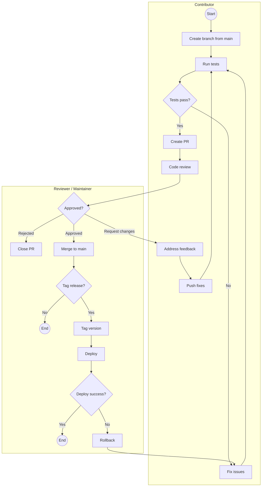

# Contribute to MDK

Thank you for your interest in contributing to [MDK][mdk-repo].

This document outlines the contribution workflow for the MDK repository, from setting up your development environment to submitting pull requests and 
participating in releases.

## Security

If you discover a security vulnerability, do not report it in a public issue.

Please follow the private disclosure instructions in [SECURITY.md][security].

## Monorepo structure

MDK is a monorepo with separate backend and frontend workspaces:

- Backend:
   - `backend/core/`: Backend services, container modules, and integration/unit tests (npm-based)
   - `backend/workers/`: Protocol-translator worker packages (miners, miner-pools, power-meter, temperature, containers), per-worker mock servers, and 
per-worker tests (npm-based)
- Frontend: `ui/`: Frontend packages, demo app, and shared UI foundation (npm + Turbo-based)

Choose the backend or frontend workflow that matches the area you are contributing to.

### Root configuration must be domain-aware

The repo top level is a fixed set of domains (`ui/`, `backend/`, `docs/`, `examples/`) plus tooling and repo-meta files. Shared root config (today just `.gitignore`) is read across all of them, so every pattern must be written so it cannot silently match another domain's source:

- **Anchor anything that targets one domain's build or runtime output.** Use `/name/` for the repo root or `domain/**/name/` for a subtree. A bare `status` / `store` / `tmp` / `Checklist*` matches a file or directory of that name *anywhere*, including UI source. That is exactly what caused a prior root ignore regression, where bare `status` / `store` swallowed `ui/packages/ui-core/src/store/`.
- **Keep per-domain ignores in that domain's own `.gitignore`** (`ui/.gitignore`, the per-package backend `.gitignore`s), not the root. Things like `dist`, `.turbo`, and `build` belong to a domain.
- **Lint/format/type config is domain-owned, not shared at the root.** `ui/` ships its own `eslint.config.mjs` / `tsconfig.base.json` / `.prettierrc`; backend uses `standard`. Do not add a root-level eslint/tsconfig/prettier that would apply across domains.
- **A genuinely shared convention is fine if it applies identically to every domain** - e.g. committing `config/*.json.example` while ignoring the generated `config/*.json`. Note it as shared so the intent is clear.

## Get started

### Prerequisites

Before contributing, ensure you have the following installed:

- **Node.js** (version >=24)
- **Git** (latest stable version)
- **npm** (version 11 or higher)

### Licensing

MDK is released under the [**Apache License 2.0**][license].

By contributing, you agree that:

- You retain copyright over your contributions
- You grant a perpetual, worldwide, royalty-free license for their use
- Contributions are provided **“AS IS”**, without warranty

## Development environment setup

<details>
<summary>1. Fork and clone</summary>

1. Fork [the repository][mdk-repo-git] on GitHub.
2. Clone your fork locally and navigate into the project directory:
```bash
git clone https://github.com/username/mdk.git
cd mdk
```

3. Add the upstream remote:

```bash
git remote add upstream https://github.com/tetherto/mdk.git
```

</details>

<details>
<summary>2. Stay in sync</summary>

Keep your fork in sync with the main repository. For example:

```bash
git fetch upstream
git merge --ff-only upstream/main   # fails loudly if main has diverged
```

</details>

### Backend contribution setup

Use this workflow when contributing to backend code under `backend/core/`.

```bash
cd backend/core
npm install
```

#### Common commands

```bash
# Lint backend code
npm run lint

# Run backend test suite (lint + unit + integration + package tests)
npm test

```

### Frontend contribution setup 

Use this workflow when contributing to frontend code under `ui/`.

```bash
cd ui
npm install
```

#### Common commands

```bash
# Build packages
npm run build

# Run dev mode (all packages + demo)
npm run dev

# Lint and type-check
npm run lint
npm run typecheck

# Run tests
npm test
```

## Pull request workflow

### Conventional types

MDK uses Conventional Commits-style types for both branch names and PR titles.

| Type | Use for |
|---|---|
| `feat` | New features |
| `fix` | Bug fixes |
| `docs` | Documentation changes |
| `refactor` | Code refactoring without behaviour change |
| `test` | Test additions or changes |
| `chore` | Tooling, dependencies, repo maintenance |
| `perf` | Performance improvements |
| `style` | Formatting only (no logic change) |
| `ci` | CI configuration changes |
| `build` | Build system or external dependency changes |

### Branch naming convention

Create branches using the following pattern:

```bash
{type}/{short-description}
```

Where `{type}` is one of the [conventional types](#conventional-types).

#### Branch naming examples

```bash
# New feature
git checkout -b feat/mdk-new-device

# Bug fix
git checkout -b fix/timeout-handling
```

### Pull request steps

1. Sync your local main with upstream `main`.
2. Create a branch from local `main`.
3. Make your code changes.
4. Write or update tests.
5. Run linting and tests locally in the workspaces you changed:
   - `core`: `npm run lint && npm test`
   - `ui`: `npm run lint && npm test` (and `npm run typecheck` for TypeScript changes)
6. Commit changes with meaningful messages.
7. Push your branch and open a Pull Request targeting the upstream `main`.

### PR checklist

Before submitting your PR, ensure that:

- [ ] Code builds locally (`npm run build` for `ui` changes)
- [ ] Tests pass in affected workspaces (`npm test`)
- [ ] Linting passes (`npm run lint`)
- [ ] Type-check passes for frontend TypeScript changes (`npm run typecheck`)
- [ ] New features include tests
- [ ] Public behavior or APIs changes have a [`docs-needed` issue][docs-needed-issue] linked to the PR

### PR title format

Use the following convention:

```bash
{type}({scope}): {description}
```

Where `{type}` is one of the [conventional types](#conventional-types) and `{scope}` is the affected area, for example `miner` or `ui`.

Examples:

- `feat(miner): add Antminer S21 support`
- `fix(timeout): resolve action timeout handling`
- `docs(api): update stats documentation`

## PR review

All pull requests go through the following review steps:

1. **Automated checks**: Linting and tests must pass.
2. **Code review**: At least 2 maintainer approvals are required.
3. **Feedback resolution**: All requested changes must be addressed.
4. **Squash and merge**: Maintainers squash commits to keep history clean.

### Workflow diagram



## Code standards

MDK uses **StandardJS** style to keep the codebase consistent and easy to review across repositories.

Key rules:

- 2-space indentation
- No semicolons
- Single quotes for strings
- Space after keywords (`if`, `for`, `while`)
- No unused variables

## Versioning and tagging

### Version tagging

```bash
git checkout main
git pull origin main

git tag -a v1.2.0 -m "Release v1.2.0: Add RTD support"

git push origin main
git push origin v1.2.0
```

### Versioning scheme

MDK follows **Semantic Versioning**:

- **MAJOR** (`1.x.x`): breaking changes
- **MINOR** (`x.1.x`): new backward-compatible features
- **PATCH** (`x.x.1`): backward-compatible bug fixes

Happy contributing, and thanks for helping improve MDK! 🚀

## Links

[mdk-repo]: https://github.com/tetherto/mdk/
<!-- docs@tether.io: external link — preserve URL -->

[security]: SECURITY.md
<!-- docs@tether.io: security → https://github.com/tetherto/mdk/blob/main/SECURITY.md -->

[license]: LICENSE
<!-- docs@tether.io: license → https://github.com/tetherto/mdk/blob/main/LICENSE -->

[mdk-repo-git]: https://github.com/tetherto/mdk.git
<!-- docs@tether.io: external link — preserve URL -->

[docs-needed-issue]: https://github.com/tetherto/mdk/issues/new?template=docs-needed.yml
<!-- docs@tether.io: external link — preserve URL -->
