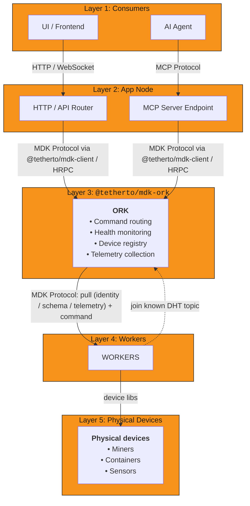
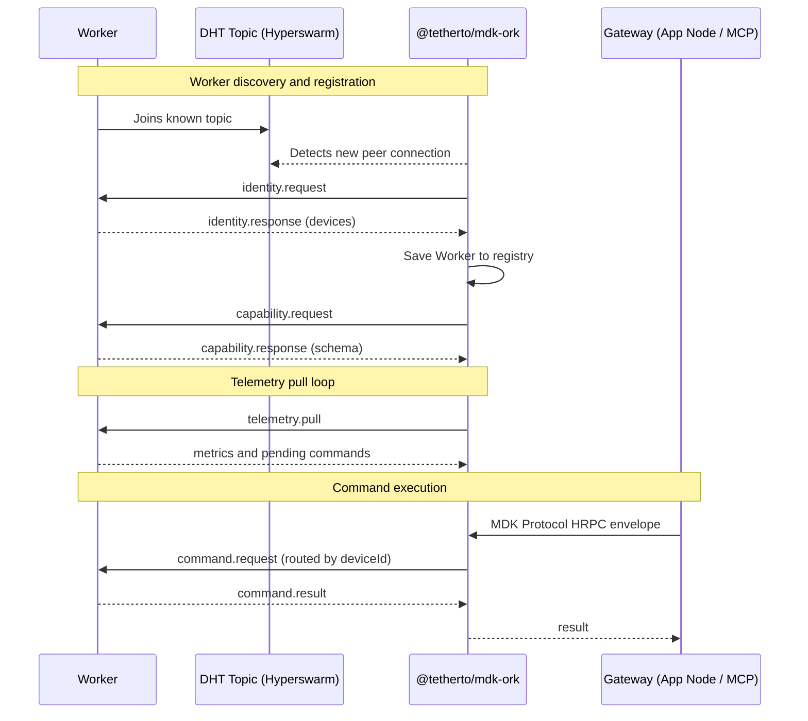
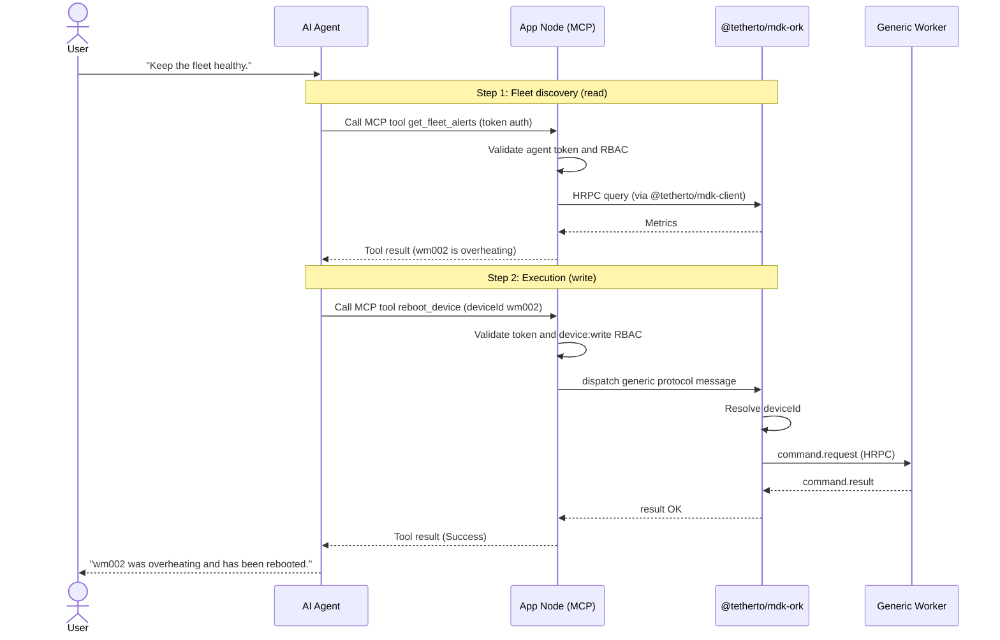
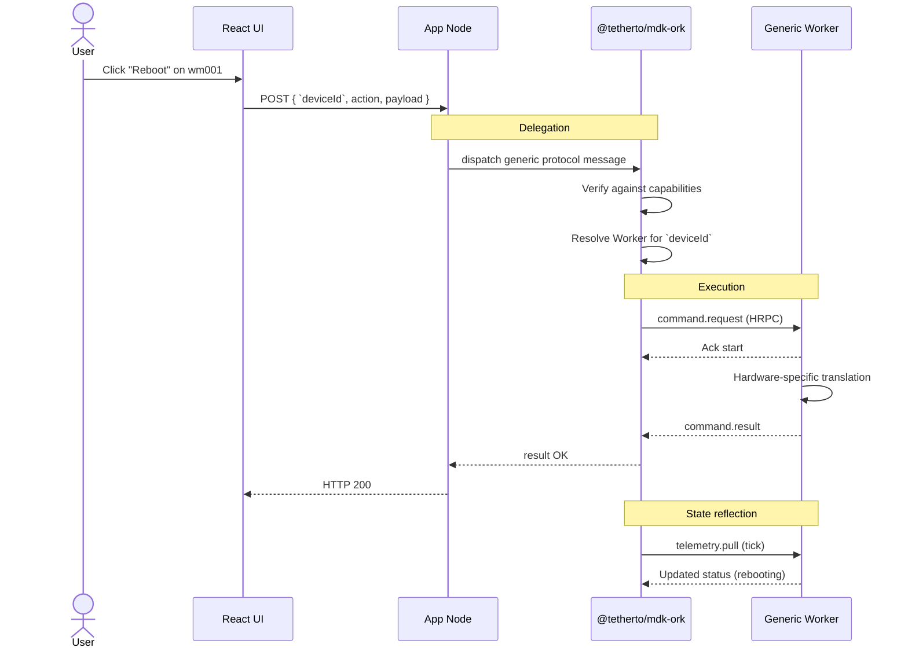
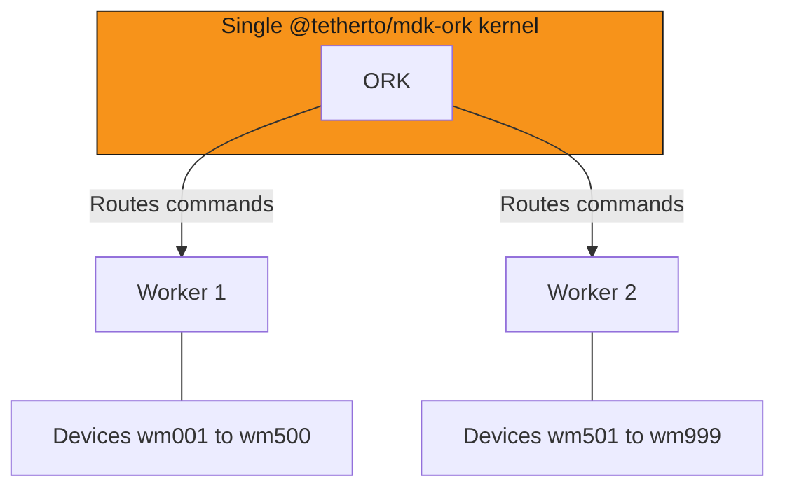

> [!NOTE]
> Status: 🚧 MDK is in active development. This page describes the target architecture and may evolve as real-world implementations land.

## How MDK works

MDK is built around a small kernel with one job: route validated commands to whichever Worker owns a device, and pull telemetry
back. Everything else (authentication, business logic, UI, AI agents) sits outside the kernel as composable layers: keeping the kernel
small and the application surface open.

To prevent unbound flexibility from manifesting as system rigidity, the architecture draws a hard line between what is
standardized and what is delegated. It's:

- **Opinionated where needed**: strict transport envelopes, unified JSON schema, unidirectional flows
- **Flexible where it matters**: isolated Workers handle translation logic, enabling integrations without polluting the core
infrastructure

Five layers compose the stack, with strict, unidirectional flows between them. The kernel itself is **ORK**, the
Orchestration Kernel, distributed as `@tetherto/mdk-ork`.

## MDK stack

The MDK components that compose those layers:

| Component | What it does |
|---|---|
| [`@tetherto/mdk-ork`][ork-section] | Central coordination: routes commands, collects telemetry, monitors health |
| [`@tetherto/mdk-client`][sdk-section] | Universal SDK applications use to talk to `@tetherto/mdk-ork` |
| [MDK Protocol][protocol-section] | Standardized message envelope every layer speaks |
| [MDK App Toolkit][app-toolkit] | Optional frontend tools, backend tools, and plugins on top of `@tetherto/mdk-ork` |

## Storage

[Hypercore][hypercore]-backed stores (such as
[Hyperbee][hyperbee]) are recommended across the `@tetherto/mdk-ork`, Worker, and App Node layers.
This choice satisfies all storage requirements without the operational baggage of a centralized database.

## The MDK protocol

The MDK protocol is the contract that crosses every layer of the stack. Workers become reachable — via a 
[DHT topic][worker-discovery-dht] or [same-machine discovery][worker-discovery-local], and `@tetherto/mdk-ork` 
initiates every RPC call. Workers issue no callbacks, emit no fan-out events, and make no exceptions to the direction of flow. 

> [!NOTE]
> For the full [envelope schema][envelope-impl], [action catalogue][actions-catalogue], and 
> [base command set][schemas-impl], see the [Protocol reference][protocol-reference].

### Design principles

- **Transport-agnostic**: identical messages over [in-process calls][ipc-gateway], [Holepunch RPC (HRPC)][hrpc-gateway], 
or API calls
- **Strictly unidirectional**: [Workers][workers-concept] never initiate RPC calls to `@tetherto/mdk-ork`; `@tetherto/mdk-ork`
discovers their presence and initiates all subsequent communication downwards (identity, capabilities, telemetry, commands)
- **Generic interface**: the accepted interface is defined dynamically at the Worker level via a self-describing capabilities
schema containing both structure and semantic context for AI agents

### Governance

To maintain structural integrity and contract stability across `@tetherto/mdk-ork`, App Node, and Workers, MDK protocol messages are
governed and strictly validated using [Hyperschema][hyperschema]. Hyperschema also aligns
natively with the system's underlying Hyperbee storage.

### Discovery, telemetry, and command flows

## The ORK kernel

[ORK][ork-concept], [`@tetherto/mdk-ork`][ork-package], is the trusted coordination layer at the heart of MDK. It [routes commands][command-dispatcher],
[monitors device health][health-monitor], [registers Workers][worker-registry], and [pulls telemetry][telemetry-collector] — all on a
[pull-only model][scheduler-module], so the kernel cannot be overwhelmed by upstream pressure.

When a command arrives, callers only need to provide a `deviceId`; `@tetherto/mdk-ork` resolves the owning Worker internally via
the [`CommandDispatcher`][command-dispatcher] and dispatches the `command.request`.

## Workers
[Workers][workers-concept] wrap a device library and expose it via the MDK protocol. They are the integration handlers between physical hardware
and `@tetherto/mdk-ork`, and the unyielding source of truth for that hardware: `@tetherto/mdk-ork` itself operates purely as a synchronized state
machine over Worker-reported state.

Workers are passive — ORK initiates every RPC call; Workers only ever respond. ORK discovers Workers according to the
[discovery model][workers-discovery-model], then requests identity and capabilities.

## The SDK

The [`@tetherto/mdk-client`][client-package] SDK is the transport abstraction layer used to connect to `@tetherto/mdk-ork` reliably. 
It is the essential glue between the kernel and any consumer layer developers choose to build on top.

**Responsibility**: connects the MDK Protocol over native transports (HRPC or IPC) seamlessly, offering:

- **Transport abstraction**: handles MDK Protocol message construction and reconnection logic with exponential backoff.
- **Automatic transport selection**: the SDK picks the transport mechanism based entirely on the URL scheme provided by the
developer.
  - `hrpc://` connects over encrypted Hyperswarm streams for remote server-to-server production.
  - `ipc://` connects via direct local sockets for low-latency local testing.
- **Major language support**: `@tetherto/mdk-client` is intended to support all major languages (Node.js, Python, Go, and others), allowing
developers to dispatch commands, subscribe to live streams, or pull status snapshots from any stack.

## App Node

The [App Node][app-node-package] wraps `@tetherto/mdk-client` — the MDK protocol connector to ORK — to add an authenticated
HTTP, WebSocket, and MCP interface on top. Consumers that need those capabilities connect through the App Node.

The supported development path is the [MDK App Toolkit][app-toolkit], which ships backend middleware (JWT auth, RBAC, and command
proxying), frontend tools, and an `mdk-plugin.json`-based plugin system for declarative HTTP route extensions
([plugin guide][app-node-plugins]).

For the full developer model — extension patterns, data access, auth design, and ORK connection — read the [App Node concept page][app-node-concept].

## AI agents and the MCP server

AI agents connect to MDK through an **MCP endpoint** on the App Node, not directly to `@tetherto/mdk-ork`. By routing agents through the App Node, 
developers can keep them inside the same security envelope as every other consumer: they are ordinary authenticated clients; subject to the same JWT validation, rate limits, and RBAC as a human user. This is intentional: the kernel does not perform user-level [authentication][authentication-section]. 

What makes the integration distinctive is **[runtime tool derivation][agent-ready-contract]**. The tools exposed to an agent (for example,
`get_device_telemetry` or `reboot_device`) are not hardcoded; they are parsed at runtime from each registered Worker's
[`mdk-contract.json`][capability-contract-section]. When a new device type joins the network, the agent gains
the ability to query and control it without any change to the App Node.

## End-to-end data flows

Two scenarios show the full request path from consumer to device and back: a [human user clicking through the UI][human-ui-scenario], and an [AI
agent executing a multi-step prompt][ai-agent-scenario].

### AI agent scenario

A user instructs the AI Agent: *"Keep the fleet healthy."* The agent monitors continuously, catches `wm002` overheating, reboots it, and notifies the user.

### Human UI scenario

A user clicks "Reboot" on device `wm001` in the UI.

## Scaling

As MDK deployments scale to large mining sites (5,000+ devices), the system must explicitly manage parallel Workers and parallel
`@tetherto/mdk-ork` instances. The kernel is only an execution layer; it does not perform application-level aggregation or
cross-regional business logic.

> [!NOTE]
> Scaling here means *how many* Workers and kernels you run. That is independent of [deployment topology][deployment-topologies] — 
*how those processes are packaged* on a host (one process vs many).

### Parallel Workers

Multiple Workers of the same type (for example, `whatsminer-worker`) can be active concurrently and connected to the same
`@tetherto/mdk-ork` kernel.

**Device-level routing and ownership**: Workers never share devices. When a Worker connects, its `identity.register` payload
explicitly lists the `deviceId`s it exclusively manages. The Worker registry maintains this strict mapping and deterministically
routes arriving commands to the designated Worker.

### Multi-site deployments

A deployment may need to manage multiple massive physical boundaries (for example, a Texas Site and an Iceland Site). Each
location runs its own dedicated site-level `@tetherto/mdk-ork` kernel, but all are overseen globally by a single App Node and AI Agent.

The single App Node and AI Agent connect globally to all distributed `@tetherto/mdk-ork` kernels via the native HRPC mesh (Hyperswarm).
Parallel `@tetherto/mdk-ork` instances remain entirely isolated from one another: they do not federate registries, share queues, or
synchronize state. A crash at one site has zero impact on any other.

Cross-site aggregation is handled purely at the App Node layer, where routes query multiple Workers via `@tetherto/mdk-ork` and merge
the responses before returning them to the UI or Agent.

## Links

[ork-section]: #the-ork-kernel
[sdk-section]: #the-sdk
[protocol-section]: #the-mdk-protocol
[authentication-section]: stack/app-node.md#authentication-design
<!-- docs@tether.io: authentication-section → concepts/stack/app-node#authentication-design -->
[capability-contract-section]: stack/workers.md#capability-contract
<!-- docs@tether.io: capability-contract-section → concepts/stack/workers#capability-contract -->
[human-ui-scenario]: #human-ui-scenario
[ai-agent-scenario]: #ai-agent-scenario

[deployment-topologies]: deployment-topologies.md
<!-- docs@tether.io: deployment-topologies → concepts/deployment-topologies -->

[worker-discovery]: stack/workers.md
<!-- docs@tether.io: worker-discovery → concepts/stack/workers -->

[worker-discovery-dht]: stack/workers.md#dht-mode
<!-- docs@tether.io: worker-discovery-dht → concepts/stack/workers#dht-mode -->

[worker-discovery-local]: stack/workers.md#local-mode
<!-- docs@tether.io: worker-discovery-local → concepts/stack/workers#local-mode -->

[workers-concept]: stack/workers.md
<!-- docs@tether.io: workers-concept → concepts/stack/workers -->

[workers-discovery-model]: stack/workers.md#discovery-model
<!-- docs@tether.io: workers-discovery-model → concepts/stack/workers#discovery-model -->

[hypercore]: https://github.com/holepunchto/hypercore
<!-- docs@tether.io: external link — preserve URL -->

[hyperbee]: https://github.com/holepunchto/hyperbee
<!-- docs@tether.io: external link — preserve URL -->

[hyperschema]: https://github.com/holepunchto/hyperschema
<!-- docs@tether.io: external link — preserve URL -->

[hyperswarm]: https://github.com/holepunchto/hyperswarm
<!-- docs@tether.io: external link — preserve URL -->

[app-toolkit]: ../../ui/docs/ARCHITECTURE.md
<!-- docs@tether.io: app-toolkit → concepts/stack/app-toolkit -->
<!-- mdk-monorepo: temp — ARCHITECTURE.md is a stub until ui/ is populated -->

[app-node-plugins]: ../how-to/app-node/plugins.md
<!-- docs@tether.io: app-node-plugins → how-to/app-node/plugins -->

[protocol-reference]: ../../backend/core/ork/README.md
<!-- docs@tether.io: protocol-reference → https://github.com/tetherto/mdk/blob/main/backend/core/ork/README.md -->

[ork-package]: ../../backend/core/ork/README.md
<!-- docs@tether.io: ork-package → https://github.com/tetherto/mdk/blob/main/backend/core/ork/README.md -->

[ork-concept]: stack/ork.md
<!-- docs@tether.io: ork-concept → concepts/stack/ork -->

[worker-base]: ../../backend/workers/base/README.md
<!-- docs@tether.io: worker-base → https://github.com/tetherto/mdk/blob/main/backend/workers/base/README.md -->

[app-node-package]: ../../backend/core/app-node/README.md
<!-- docs@tether.io: app-node-package → https://github.com/tetherto/mdk/blob/main/backend/core/app-node/README.md -->

[app-node-concept]: stack/app-node.md
<!-- docs@tether.io: app-node-concept → concepts/stack/app-node -->

[client-package]: ../../backend/core/client/README.md
<!-- docs@tether.io: client-package → https://github.com/tetherto/mdk/blob/main/backend/core/client/README.md -->

<!-- Engineer / maintainer deep links (public repo targets) -->

[envelope-impl]: ../../backend/core/ork/lib/protocol/envelope.js
<!-- docs@tether.io: envelope-impl → https://github.com/tetherto/mdk/blob/main/backend/core/ork/lib/protocol/envelope.js -->

[actions-catalogue]: ../../backend/core/ork/lib/protocol/actions.js
<!-- docs@tether.io: actions-catalogue → https://github.com/tetherto/mdk/blob/main/backend/core/ork/lib/protocol/actions.js -->

[schemas-impl]: ../../backend/core/ork/lib/protocol/schemas.js
<!-- docs@tether.io: schemas-impl → https://github.com/tetherto/mdk/blob/main/backend/core/ork/lib/protocol/schemas.js -->

[hrpc-gateway]: ../../backend/core/ork/lib/transport/hrpc-gateway.js
<!-- docs@tether.io: hrpc-gateway → https://github.com/tetherto/mdk/blob/main/backend/core/ork/lib/transport/hrpc-gateway.js -->

[ipc-gateway]: ../../backend/core/ork/lib/transport/ipc-gateway.js
<!-- docs@tether.io: ipc-gateway → https://github.com/tetherto/mdk/blob/main/backend/core/ork/lib/transport/ipc-gateway.js -->

[dht-listener]: ../../backend/core/ork/lib/discovery/dht-listener.js
<!-- docs@tether.io: dht-listener → https://github.com/tetherto/mdk/blob/main/backend/core/ork/lib/discovery/dht-listener.js -->

[command-dispatcher]: ../../backend/core/ork/README.md#commanddispatcher
<!-- docs@tether.io: command-dispatcher → https://github.com/tetherto/mdk/blob/main/backend/core/ork/README.md#commanddispatcher -->

[health-monitor]: ../../backend/core/ork/README.md#healthmonitor
<!-- docs@tether.io: health-monitor → https://github.com/tetherto/mdk/blob/main/backend/core/ork/README.md#healthmonitor -->

[worker-registry]: ../../backend/core/ork/README.md#workerregistry
<!-- docs@tether.io: worker-registry → https://github.com/tetherto/mdk/blob/main/backend/core/ork/README.md#workerregistry -->

[telemetry-collector]: ../../backend/core/ork/README.md#telemetrycollector
<!-- docs@tether.io: telemetry-collector → https://github.com/tetherto/mdk/blob/main/backend/core/ork/README.md#telemetrycollector -->

[scheduler-module]: ../../backend/core/ork/README.md#scheduler
<!-- docs@tether.io: scheduler-module → https://github.com/tetherto/mdk/blob/main/backend/core/ork/README.md#scheduler -->

[worker-adapter]: ../../backend/workers/base/README.md#mdkworkeradapter
<!-- docs@tether.io: worker-adapter → https://github.com/tetherto/mdk/blob/main/backend/workers/base/README.md#mdkworkeradapter -->

[worker-example]: ../../backend/workers/miners/whatsminer/lib/mdk-whatsminer-worker.js
<!-- docs@tether.io: worker-example → https://github.com/tetherto/mdk/blob/main/backend/workers/miners/whatsminer/lib/mdk-whatsminer-worker.js -->

[capability-contract-example]: ../../backend/workers/miners/whatsminer/mdk-contract.json
<!-- docs@tether.io: capability-contract-example → https://github.com/tetherto/mdk/blob/main/backend/workers/miners/whatsminer/mdk-contract.json -->

[app-node-http-worker]: ../../backend/core/app-node/README.md#http-api-overview
<!-- docs@tether.io: app-node-http-worker → https://github.com/tetherto/mdk/blob/main/backend/core/app-node/README.md#http-api-overview -->

[app-node-auth]: ../../backend/core/app-node/README.md#security-model
<!-- docs@tether.io: app-node-auth → https://github.com/tetherto/mdk/blob/main/backend/core/app-node/README.md#security-model -->

[agent-ready-contract]: ../reference/maintainers/agent-ready-sdk.md
<!-- docs@tether.io: agent-ready-contract → https://github.com/tetherto/mdk/blob/main/docs/reference/maintainers/agent-ready-sdk.md -->
