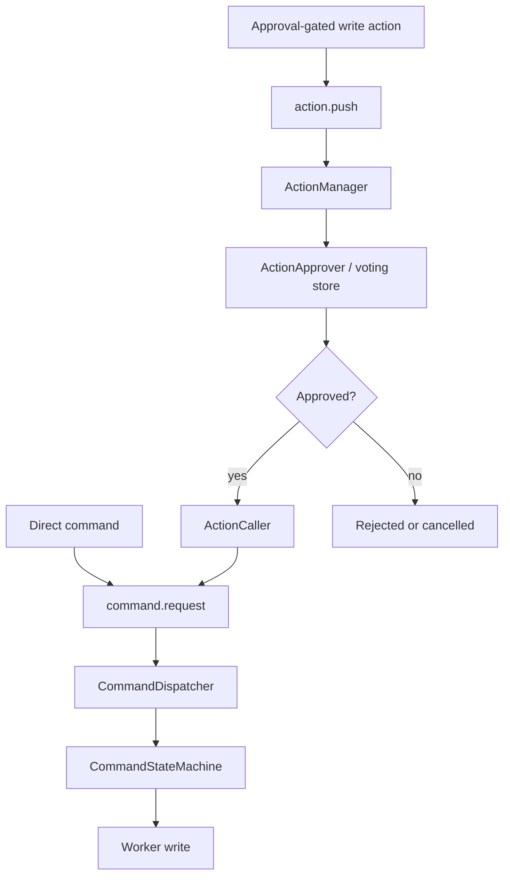

## Overview

This page covers authenticated requests, live reads, command dispatch, and approval-gated writes. It spans
the Gateway, Kernel, and Workers, but each layer owns a different responsibility.

Use this page to understand which layer receives a request, which layer validates it, and when a write becomes a command. 

> [!NOTE]
> For package-level APIs and configuration, use the [Gateway README][gateway-readme], [Kernel README][kernel-readme], and [Worker README][worker-readme].

## Responsibility boundaries

**Gateway** owns the consumer-facing surface, including HTTP, WebSocket, MCP, plugins, authentication, and RBAC. Browser UIs and agents
should enter MDK through the Gateway (they do not talk to Kernel directly).

**Kernel** owns coordination: Worker registry, telemetry routing, health checks, command dispatch, command state, and the
write-action approval modules. Kernel trusts established callers; it does not validate user identity.

**Workers** own hardware integration. They declare capabilities, answer Kernel-initiated telemetry and state pulls, resolve candidate
write calls for approval-gated actions, and execute final commands against devices.

## Connection direction

The direction of each connection is intentional:

- Consumers call the Gateway over HTTP, WebSocket, or MCP
- The Gateway dials Kernel over [Hyperswarm RPC (HRPC)][hrpc-glossary] through `@tetherto/mdk-client`
- Kernel discovers Workers, then initiates every Worker RPC
- Workers never initiate upstream calls to Kernel or the Gateway

The [deployment topologies][deployment-topologies] and [Workers discovery model][workers-discovery] pages cover how this changes
across single-process, local, and distributed deployments.

## Transport identity and admission

HRPC uses encrypted Noise connections with public-key identities. Kernel's HRPC public key identifies and addresses the
Kernel listener. Each caller has a separate public key that the listener receives during connection setup.

Kernel compares the caller's key with the allowlist. An empty allowlist admits any HRPC caller; a configured allowlist
admits the approved callers. This transport-level check works the same way whether the processes share a host or
when they communicate across a network.

Transport identity is not user identity. The HRPC allowlist controls which backend processes may connect to Kernel; the
Gateway separately validates JWTs and enforces RBAC for people, browser applications, and agents.

## Request paths

### Read requests

Reads usually start in a Gateway route or plugin controller, pass through `services.mdkClient`, and reach Kernel as registry,
capability, telemetry, or state queries. Kernel routes Worker-owned reads down to the relevant Worker and returns the result to the
Gateway. Gateway controllers can combine live Kernel data with persisted local data from `services.dataProxy`.

> [!NOTE]
> For plugin controller mechanics, use the [Gateway plugins guide][plugins-how-to].

### Direct commands

Direct commands are immediate writes that do not require approval. The Gateway validates the request and RBAC at the route layer,
then sends a `command.request` to Kernel. Kernel resolves the owning Worker, validates the command against the Worker's capabilities,
and hands the command to the crash-recoverable command state machine.

> [!NOTE]
> For command-dispatch module details, use the [Kernel README][kernel-readme].

### Approval-gated writes

Some writes are staged for approval before they become commands. This keeps direct commands available while adding a separate
review path for fleet-changing actions that need operator approval.

The Gateway owns the `/auth/actions*` HTTP surface and checks route-level RBAC such as `actions:w`. Kernel owns
`ActionManager`, `ActionCaller`, and target permission checks at the protocol layer. Those Kernel checks use the target
Worker's device family, such as `miner:w` or `container:w`, before resolving or approving writes. Workers answer
`write.calls.request` while Kernel resolves candidate writes, then execute the final `command.request` after the configured vote
thresholds are met.

> [!NOTE]
> For implementation steps, use the [write-actions how-to][write-actions-how-to]. For React hook names and exports, use the [React adapter README][react-adapter-readme].

## Developer surfaces

The write-action flow is reachable from two different layers depending on where you are building.

| Layer | Package | How you call it |
|---|---|---|
| React / UI | [`@tetherto/mdk-react-adapter`][react-adapter-readme] | Six hooks: `useSubmitSingleAction`, `useSubmitPendingActions`, `useVoteOnAction`, `useCancelAction`, `usePendingActions`, `useLiveActions` — call the Gateway `/auth/actions*` routes |
| Backend / Node.js | [`@tetherto/mdk-client`][client-readme] | Methods: `pushAction`, `pushActionsBatch`, `voteAction`, `cancelActionsBatch`, `getAction`, `getActionsBatch`, `queryActions` — send MDK Protocol envelopes directly to Kernel |

> [!IMPORTANT]
> The React hooks go through the Gateway, which enforces JWT validation and RBAC (`actions:w`) for every request. The `mdk-client`
> methods connect directly to Kernel and bypass those user-level controls. The Kernel admits backend processes according to its HRPC
> transport policy: an empty allowlist admits any HRPC caller, while a configured allowlist admits matching caller keys.

## Next steps

- Build Gateway routes with the [plugin guide][plugins-how-to]
- Submit and approve write actions with the [write-actions how-to][write-actions-how-to]
- Review the [Kernel modules][kernel-readme]
- Review Worker capabilities in the [Worker README][worker-readme]

## Links

[gateway-readme]: ../../backend/core/gateway/README.md
<!-- docs@tether.io: gateway-readme → https://github.com/tetherto/mdk/blob/main/backend/core/gateway/README.md -->

[kernel-readme]: ../../backend/core/kernel/README.md
<!-- docs@tether.io: kernel-readme → https://github.com/tetherto/mdk/blob/main/backend/core/kernel/README.md -->

[worker-readme]: ../../backend/workers/README.md
<!-- docs@tether.io: worker-readme → https://github.com/tetherto/mdk/blob/main/backend/workers/README.md -->

[react-adapter-readme]: ../../ui/packages/react-adapter/README.md
<!-- docs@tether.io: react-adapter-readme → https://github.com/tetherto/mdk/blob/main/ui/packages/react-adapter/README.md -->

[deployment-topologies]: deployment-topologies.md
<!-- docs@tether.io: deployment-topologies → concepts/deployment-topologies -->

[workers-discovery]: stack/workers.md#discovery-model
<!-- docs@tether.io: workers-discovery → concepts/stack/workers#discovery-model -->

[plugins-how-to]: ../guides/gateway/plugins.md
<!-- docs@tether.io: plugins-how-to → guides/gateway/plugins -->

[write-actions-how-to]: ../guides/gateway/write-actions.md
<!-- docs@tether.io: write-actions-guides → guides/gateway/write-actions -->

[client-readme]: ../../backend/core/client/README.md
<!-- docs@tether.io: client-readme → https://github.com/tetherto/mdk/blob/main/backend/core/client/README.md -->

[hrpc-glossary]: ../reference/glossary.md#hyperswarm-rpc
<!-- docs@tether.io: hrpc-glossary → reference/glossary#hyperswarm-rpc -->
