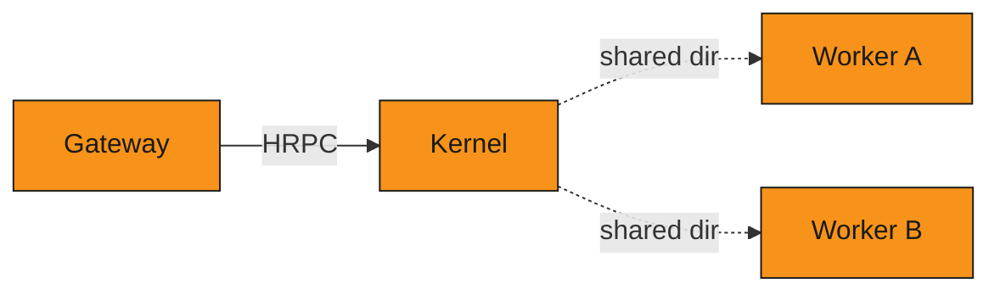
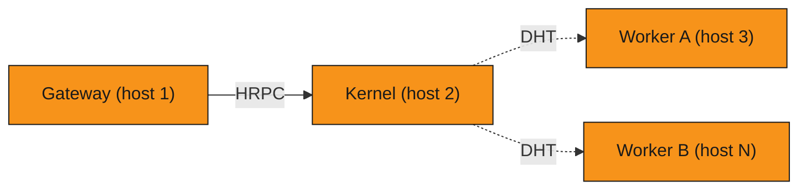

This page explains the three supported deployment shapes and when to pick each.

## Overview

MDK's runtime pieces — the [Kernel][architecture], the Gateway, and one or more Workers — can run together 
in a single process or be split across several. This is a **packaging and operations** choice, and it's 
independent of how MDK [scales logically][scaling] (adding Workers, adding sites). 

> [!NOTE]
> If Kernel, Worker, manager, or thing are unfamiliar, read the [`glossary.md`][glossary] first.

## Connection model

Before choosing a shape, it helps to understand which components initiate connections:

- The Gateway dials Kernel — it is the active side of that connection, over [Hyperswarm RPC (HRPC)][hrpc-glossary] using the Kernel's public key (read from the well-known key file on the same host, or passed as `kernelKey` for a remote host)
- Kernel discovers Workers and initiates every RPC call — Workers are passive; they become reachable and wait
- Workers never initiate any connection

This directionality is what drives the transport and discovery configuration in each shape below.
For detail, see the [Workers discovery model][architecture-workers] and the [Gateway Kernel connection][gateway-kernel-connection].

## The three shapes

### Single process

*Solid arrow: active connection initiated by the source. Dashed arrow — Kernel-initiated discovery.*

Kernel, the Gateway, and every Worker run inside one Node.js heap and event loop. Lowest footprint, simplest to start, nothing external to supervise. This is the shape behind the [single-process site how-to][single-how-to].

### Local

*Solid arrow: active connection initiated by the source. Dashed arrow — Kernel-initiated discovery.*

Each service runs as its own OS process on the same machine. Kernel discovers Workers via a shared directory — no DHT configuration needed. The [full-site example][full-site-local-discovery] runs in local mode by default.

### Microservices

*Solid arrow: active connection initiated by the source. Dashed arrow — Kernel-initiated discovery.*

Each service runs as its own OS process or container, potentially on separate hosts, supervised by pm2 or Docker and connected via DHT. This is the shape behind the [microservices site guide][multi-how-to].

## The trade-off

Pick **single-process** when:

- You are developing locally, running demos, or want a self-contained site for tests
- Footprint matters more than isolation (minimal or embedded deployments)
- You do not need supervisor-managed restarts

Pick **local** when:

- All services run on one machine and you want independent process restarts
- Outbound networking is restricted removing DHT as an option
- You want process isolation and independent restarts without the complexity of DHT

Pick **microservices** when:

- You want to allocate resources per service — CPU and memory limits per process or container
- Workers run on separate hosts from Kernel or the Gateway
- You are orchestrating many Workers across one or more hosts

## Where `worker.js` fits

The microservices shape is built on [`backend/core/mdk/worker.js`][worker-entry], a shared process entry compatible with pm2, Docker, or a direct `node worker.js`. It is driven by environment variables (`SERVICE`, and for a Worker `WORKER`/`TYPE`/`RACK`) rather than CLI flags. One `worker.js` runs per service, and the supervisor (pm2 or Docker) owns its lifecycle and resource limits. The [standalone `worker.js` install pattern][install-pattern] defines the per-Worker mechanics.

The single-process and local shapes both call the programmatic APIs (`getKernel`, `startWorker`, `startGateway`) directly. Local mode passes `discovery: { mode: 'local' }` to both `getKernel` and `startWorker` so they coordinate via a shared directory rather than DHT — see [local Worker discovery][worker-discovery-local] for configuration options.

## Relationship to scaling

Topology is orthogonal to scale. [Logical scaling][scaling] is about *how many* Workers and Kernel kernels you run (parallel Workers, per-site kernels, multi-site oversight). Deployment topology is about *how those processes are packaged* on a given host. You choose both: for example, a production site typically runs multiple processes (this page) and multiple parallel Workers per kernel ([scaling][scaling]).

## Next steps

- Run a self-contained local site: [Single-process site][single-how-to]
- Run [same-machine services without DHT][worker-discovery-local]
- Run [supervised services on one or more hosts][multi-how-to]
- Register [one miner before packaging a whole site][miner-how-to]

## Links

[architecture]: architecture.md
<!-- docs@tether.io: architecture → concepts/architecture -->

[architecture-workers]: architecture.md#workers
<!-- docs@tether.io: architecture-workers → concepts/architecture#workers -->

[gateway-kernel-connection]: stack/gateway.md#kernel-connection
<!-- docs@tether.io: gateway-kernel-connection → concepts/stack/gateway#kernel-connection -->

[scaling]: architecture.md#scaling
<!-- docs@tether.io: scaling → concepts/architecture#scaling -->

[worker-entry]: ../../backend/core/mdk/worker.js
<!-- docs@tether.io: worker-entry → https://github.com/tetherto/mdk/blob/main/backend/core/mdk/worker.js -->

[install-pattern]: ../../backend/workers/docs/install-pattern.md#standalone-via-workerjs
<!-- docs@tether.io: install-pattern → https://github.com/tetherto/mdk/blob/main/backend/workers/docs/install-pattern.md#standalone-via-workerjs -->

[single-how-to]: ../guides/deployment/run-single-process-site.md
<!-- docs@tether.io: single-how-to → guides/deployment/run-single-process-site -->

[multi-how-to]: ../guides/deployment/run-microservices-site.md
<!-- docs@tether.io: multi-how-to → guides/deployment/run-microservices-site -->

[miner-how-to]: ../guides/miners/index.md
<!-- docs@tether.io: miner-how-to → guides/miners -->

[worker-discovery-local]: stack/workers.md#local-mode
<!-- docs@tether.io: worker-discovery-local → concepts/stack/workers#local-mode -->

[full-site-local-discovery]: ../../examples/full-site/README.md#how-out-of-process-workers-find-the-kernel
<!-- docs@tether.io: full-site-local-discovery → https://github.com/tetherto/mdk/blob/main/examples/full-site/README.md#how-out-of-process-workers-find-the-kernel -->

[glossary]: ../reference/glossary.md
<!-- docs@tether.io: glossary → reference/glossary -->

[hrpc-glossary]: ../reference/glossary.md#hyperswarm-rpc
<!-- docs@tether.io: hrpc-glossary → reference/glossary#hyperswarm-rpc -->