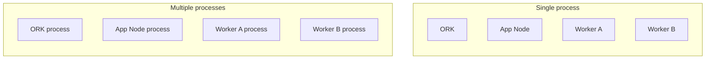

MDK's runtime pieces — the [ORK kernel][architecture], the App Node, and one or more Workers — can run together in a single process or be split across many. This is a **packaging and operations** choice, and it is independent of how MDK [scales logically][scaling] (adding Workers, adding sites). This page explains the two supported deployment shapes and when to pick each.

> [!NOTE]
> If ORK, worker, manager, or thing are unfamiliar, read [`terminology.md`](terminology.md) first.

## The two shapes

- **Single-process**: ORK, the App Node, and every Worker run inside one Node.js heap and event loop. Lowest footprint, simplest to start, nothing external to supervise. This is the shape behind the [single-process site how-to][single-how-to].
- **Multiple processes (microservices)**: Each service runs as its own OS process or container, supervised by pm2 or Docker. This is the shape behind the [microservices site how-to][multi-how-to].

## The trade-off

Pick **single-process** when:

- You are developing locally, running demos, or want a self-contained site for tests
- Footprint matters more than isolation (minimal or embedded deployments)
- You do not need supervisor-managed restarts

Pick **multiple processes** when:

- You want to allocate resources per service — CPU and memory limits per process or container
- You need to restart or scale one Worker independently of the others
- A Worker crash must not take down the App Node or its siblings (failure isolation)
- You are orchestrating many Workers across one or more hosts

## Where `worker.js` fits

The multi-process shape is built on [`backend/core/mdk/worker.js`][worker-entry], a shared process entry compatible with pm2, Docker, or a direct `node worker.js`. It is driven by environment variables (`SERVICE`, and for a Worker `WORKER`/`TYPE`/`RACK`) rather than CLI flags. One `worker.js` runs per service, and the supervisor (pm2 or Docker) owns its lifecycle and resource limits. The single-process shape instead calls the programmatic APIs (`getOrk`, `startWorker`, `startAppNode`) directly in one process. The [standalone `worker.js` install pattern][install-pattern] defines the per-Worker mechanics.

## Relationship to scaling

Topology is orthogonal to scale. [Logical scaling][scaling] is about *how many* Workers and ORK kernels you run (parallel Workers, per-site kernels, multi-site oversight). Deployment topology is about *how those processes are packaged* on a given host. You choose both: for example, a production site typically runs multiple processes (this page) and multiple parallel Workers per kernel ([scaling][scaling]).

## Next steps

Use the how-to guide for the topology you want to run:

- Run a self-contained local site: [Single-process site][single-how-to]
- Run supervised services: [Microservices site][multi-how-to]
- Register one miner before packaging a whole site: [Run a miner worker][miner-how-to]

## Links

[architecture]: architecture.md
<!-- docs@tether.io: architecture → concepts/architecture -->

[scaling]: architecture.md#scaling
<!-- docs@tether.io: scaling → concepts/architecture#scaling -->

[worker-entry]: ../../backend/core/mdk/worker.js
<!-- docs@tether.io: worker-entry → https://github.com/tetherto/mdk/blob/main/backend/core/mdk/worker.js -->

[install-pattern]: ../../backend/workers/docs/install-pattern.md#standalone-via-workerjs
<!-- docs@tether.io: install-pattern → https://github.com/tetherto/mdk/blob/main/backend/workers/docs/install-pattern.md#standalone-via-workerjs -->

[single-how-to]: ../how-to/deployment/run-single-process-site.md
<!-- docs@tether.io: single-how-to → how-to/deployment/run-single-process-site -->

[multi-how-to]: ../how-to/deployment/run-microservices-site.md
<!-- docs@tether.io: multi-how-to → how-to/deployment/run-microservices-site -->

[miner-how-to]: ../how-to/miners/index.md
<!-- docs@tether.io: miner-how-to → how-to/miners -->
