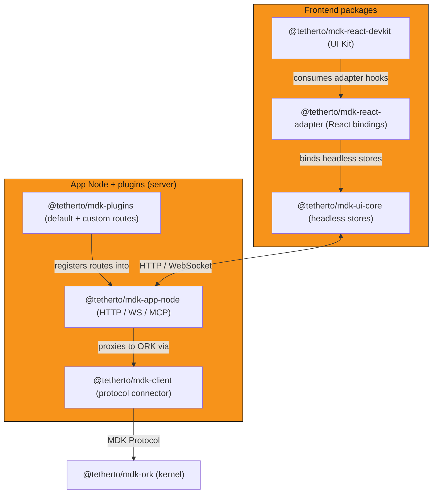

## Overview

The MDK App Toolkit is the recommended development path for teams building MDK-powered applications. It is composed of
three coordinated layers:

- App Node backend
- Plugin system
- Frontend packages

Not every layer is required for every consumer type.

MDK supports two primary consumer patterns:

- **Human operator UI**: a frontend application connects to the App Node's REST and WebSocket APIs. The full three-layer
  toolkit applies — App Node, plugin system, and frontend packages
- **AI agent / headless consumer**: an AI agent connects to the App Node's MCP endpoint and subscribes to telemetry feeds
  directly. The frontend packages are not required; the App Node and plugin system
  alone are sufficient

> [!NOTE]
> Using [`@tetherto/mdk-client`][mdk-client] without the App Node runtime is technically possible — you write your own auth,
> routing, and middleware — but it is not supported by this monorepo. Most applications build on the App Node.

## App Node layer

`@tetherto/mdk-app-node` is the backend component of the toolkit. It wraps [`@tetherto/mdk-client`][mdk-client] — the ORK protocol connector —
and delivers an authenticated HTTP, WebSocket, and MCP interface for consumers that need those capabilities. Read the
[App Node concept page][app-node-concept] for the full developer model: extension patterns, data access, auth design, and ORK connection.

As a toolkit component, the App Node provides out of the box:

- Fastify-based HTTP server and WebSocket endpoint
- JWT authentication, session management, and OAuth2 (Google and Microsoft)
- RBAC enforcement at the route level
- Command proxying and telemetry subscriptions to ORK via `@tetherto/mdk-client`
- MCP endpoint for AI agents

## Plugin system

`@tetherto/mdk-plugins` is the extension mechanism. A plugin is a directory containing an [`mdk-plugin.json`][plugins-manifest] manifest and one or
more controller files. The App Node discovers and loads plugins from directories passed via [`extraPluginDirs`][plugins-mounting].

The toolkit ships defaults plugins, e.g., `auth` (user authentication routes), `telemetry` (hashrate, efficiency, temperature
metrics), and `site-hashrate` (aggregated site history). Any plugin you write loads identically.

> [!TIP]
> - [Plugin authoring guide][plugins-how-to] — build process, manifest schema, controller contract
> - [Plugin reference][plugins-readme] — manifest schema, default routes, loader errors

## Frontend packages

These packages are for the **human operator UI** pattern — the application layer that connects to the App Node's REST and
WebSocket APIs. If your consumer is an AI agent connecting via the MCP endpoint, this layer is not required.

> [!NOTE]
> Early versions of MDK ship three layered workspace packages within the monorepo. 
> npm packages will be published as the tooling matures.

Consuming applications add the workspace dependencies directly. Consuming the whole chain is the recommended path for operator UIs.

> [!TIP]
> The [UI architecture reference][ui-architecture] covers the full dependency graph, build strategy, and package internals.

**[`@tetherto/mdk-ui-core`][ui-core]**: framework-agnostic headless core. No React imports. Provides Zustand vanilla stores
(`authStore`, `devicesStore`, `notificationStore`, `timezoneStore`, `actionsStore`), a TanStack `QueryClient` factory with
environment-aware base URL resolution, and shared type contracts.

**[`@tetherto/mdk-react-adapter`][react-adapter]**: React bindings for the core. Provides `<MdkProvider apiBaseUrl={...}>`
(required at the app root) and store hooks (`useAuth`, `useDevices`, `useTimezone`, `useNotifications`, `useActions`).

**[`@tetherto/mdk-react-devkit`][react-devkit]**: React UI library. `src/core/` ships generic UI primitives built on Radix UI
(Button, Dialog, Switch, Select, Data Table, Charts). `src/foundation/` ships mining-domain components, features, and presentation hooks.

### Developer entry points

The toolkit can be adopted at any of the following entry points, from most batteries-included to least.

| Entry point | Package | What ships | What you write | When to choose |
|---|---|---|---|---|
| UI Kit | `@tetherto/mdk-react-devkit` (`/core` + `/foundation` entrypoints) | Pre-built React components, shell layout, ready-made ops dashboard | Data wiring, optional theming | You want a dashboard up fast |
| Framework adapter | `@tetherto/mdk-react-adapter` (React today; Vue/Svelte/WC planned) | `<MdkProvider>`, store hooks, TanStack Query re-exports | Your own components and layout | You have a design system already |
| UI Core | [`@tetherto/mdk-ui-core`][ui-core-ref] | Zustand vanilla stores, `QueryClient` factory | Framework bindings or headless utilities | You need store access outside React or are building a new adapter |
| Raw SDK | `@tetherto/mdk-client` | MDK Protocol client, connection management, reconnection | Everything above the wire: state, framework, UI | You are building a non-UI consumer (CLI, agent, backend service) |

## Architecture overview

## Next steps

- Understand the [App Node surface][app-node-concept]
- [Build or extend with the plugin system][plugins-how-to]
- Explore the [frontend package architecture][ui-architecture]

## Links

[app-node-concept]: app-node.md
<!-- docs@tether.io: app-node-concept → concepts/stack/app-node -->

[app-node-readme]: ../../../backend/core/app-node/README.md
<!-- docs@tether.io: app-node-readme → https://github.com/tetherto/mdk/blob/main/backend/core/app-node/README.md -->

[plugins-readme]: ../../../backend/core/plugins/README.md
<!-- docs@tether.io: plugins-readme → https://github.com/tetherto/mdk/blob/main/backend/core/plugins/README.md -->

[plugins-manifest]: ../../../backend/core/plugins/README.md#manifest-format
<!-- docs@tether.io: plugins-manifest → https://github.com/tetherto/mdk/blob/main/backend/core/plugins/README.md#manifest-format -->

[plugins-mounting]: ../../../backend/core/plugins/README.md#mounting-plugins
<!-- docs@tether.io: plugins-mounting → https://github.com/tetherto/mdk/blob/main/backend/core/plugins/README.md#mounting-plugins -->

[plugins-how-to]: ../../how-to/app-node/plugins.md
<!-- docs@tether.io: plugins-how-to → how-to/app-node/plugins -->

[ui-architecture]: ../../../ui/docs/ARCHITECTURE.md
<!-- docs@tether.io: ui-architecture → https://github.com/tetherto/mdk/blob/main/ui/docs/ARCHITECTURE.md -->

[ui-core]: ../../../ui/packages/ui-core/README.md
<!-- docs@tether.io: ui-core → https://github.com/tetherto/mdk/blob/main/ui/packages/ui-core/README.md -->

[ui-core-ref]: ../../../ui/packages/ui-core/README.md
<!-- docs@tether.io: ui-core-ref → reference/app-toolkit/ui-core -->

[react-adapter]: ../../../ui/packages/react-adapter/README.md
<!-- docs@tether.io: react-adapter → https://github.com/tetherto/mdk/blob/main/ui/packages/react-adapter/README.md -->

[react-devkit]: ../../../ui/packages/react-devkit/README.md
<!-- docs@tether.io: react-devkit → https://github.com/tetherto/mdk/blob/main/ui/packages/react-devkit/README.md -->

[mdk-client]: ../../../backend/core/client/README.md
<!-- docs@tether.io: mdk-client → https://github.com/tetherto/mdk/blob/main/backend/core/client/README.md -->
