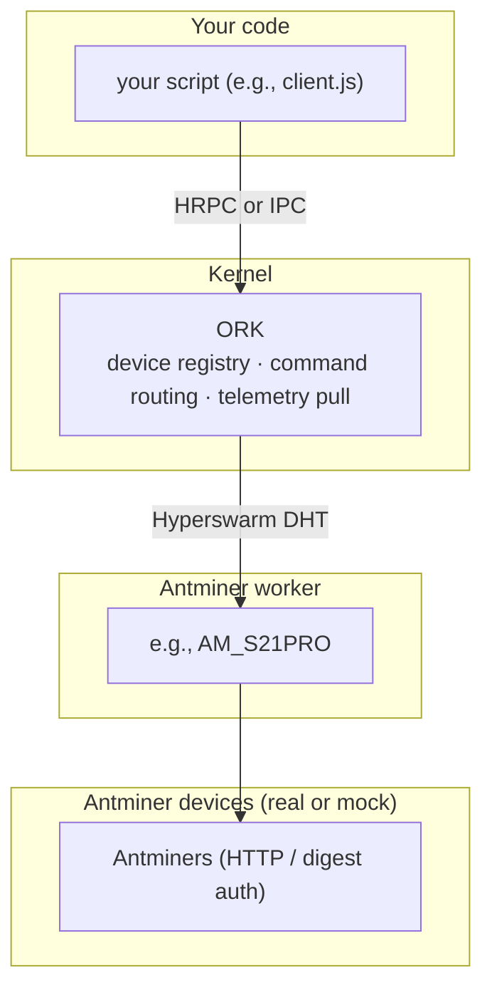

This page explains the terms you need to familiarize yourself with, using an Antminer rack as an example.

## Terms you need to name

| Term | What it is | Lives at |
| --- | --- | --- |
| **ORK** (Orchestration Kernel) | The pull-only kernel that owns the device registry, routes commands, and aggregates telemetry. | [`backend/core/ork/index.js`][ork-package] |
| **App Node** | The developer-owned gateway between non-Node clients (UI, AI agents) and ORK. Mandatory whenever a non-Node consumer reaches the kernel; not used in the in-process Antminer-rack example below. | [`backend/core/app-node/`][app-node-package] |
| **Worker** | A device-family translator. Speaks the MDK Protocol upward to ORK and the vendor's native API downward to one device family (one miner brand, one container type, one pool API). | [`backend/workers/docs/install-pattern.md`][worker-install] |
| **Manager class** | The JavaScript class a worker exports, one per supported device model. Instances drive a single rack of devices. | e.g. `AM_S19XP`, `AM_S21` in [`backend/workers/miners/antminer/index.js`][antminer-worker] |
| **Thing** | One registered device instance. Created by calling `manager.registerThing({ info, opts })`. Identified by a generated `deviceId`. | runtime, in `manager.mem.things` |

## How they compose, for an Antminer rack

The same shape repeats for every other device family (Whatsminer, container vendors, pool APIs). For a multi-worker view, parallel workers, and multi-site deployments, see [`architecture.md#scaling`][architecture-scaling].

## What this section does NOT cover

- Multi-process discovery across machines — [worker discovery][worker-discovery].
- App Node implementation details (HTTP routing, JWT auth, RBAC) — see [`backend/core/app-node/worker.js`][app-node-package].
- Building your own worker for a new device family — see [`backend/workers/docs/install-pattern.md`][worker-install].
- Per-device contract details (telemetry units, command shapes, error codes) — those live in each worker's `mdk-contract.json`, e.g. [`backend/workers/miners/antminer/mdk-contract.json`][antminer-contract].

## Next steps

- You are ready to run the example in [Run the stack][run-stack].

## Links

[run-stack]: ../tutorials/get-started/run.md
<!-- docs@tether.io: run-stack → tutorials/backend-stack/run -->

[architecture-scaling]: architecture.md#scaling
<!-- docs@tether.io: architecture-scaling → concepts/architecture#scaling -->

[ork-package]: ../../backend/core/ork/index.js
<!-- docs@tether.io: ork-package → https://github.com/tetherto/mdk/blob/main/backend/core/ork/index.js -->

[app-node-package]: ../../backend/core/app-node/worker.js
<!-- docs@tether.io: app-node-package → https://github.com/tetherto/mdk/blob/main/backend/core/app-node/worker.js -->

[worker-install]: ../../backend/workers/docs/install-pattern.md
<!-- docs@tether.io: worker-install → https://github.com/tetherto/mdk/blob/main/backend/workers/docs/install-pattern.md -->

[antminer-worker]: ../../backend/workers/miners/antminer/index.js
<!-- docs@tether.io: antminer-worker → https://github.com/tetherto/mdk/blob/main/backend/workers/miners/antminer/index.js -->

[worker-discovery]: stack/workers.md
<!-- docs@tether.io: worker-discovery → concepts/stack/workers -->

[antminer-contract]: ../../backend/workers/miners/antminer/mdk-contract.json
<!-- docs@tether.io: antminer-contract → https://github.com/tetherto/mdk/blob/main/backend/workers/miners/antminer/mdk-contract.json -->
