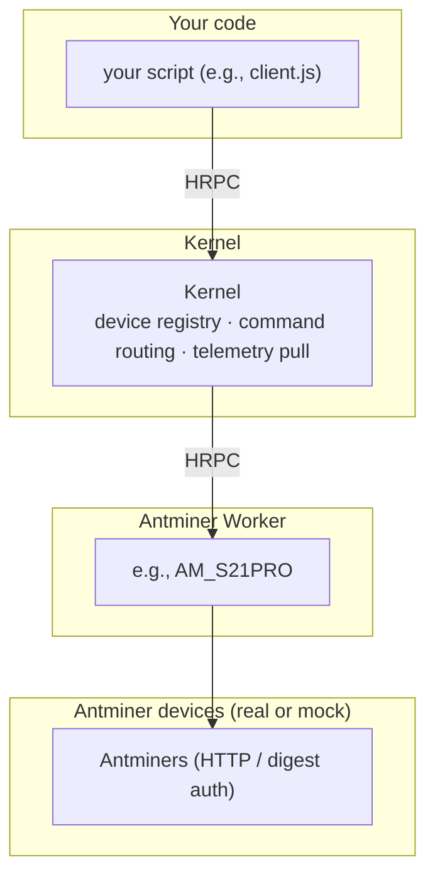

This page provides explanations for terms that new users may not be familiar with.

- [Stack](#stack-and-hardware-terms)
- [HRPC](#hyperswarm-rpc)

## Stack and hardware terms

This section explains the terms you need to familiarize yourself with, using an Antminer rack as an example.

| Term | What it is | Lives at |
| --- | --- | --- |
| **Kernel** (Orchestration Kernel) | The pull-only kernel that owns the device registry, routes commands, and aggregates telemetry. | [`backend/core/kernel/index.js`][kernel-package] |
| **Gateway** | The developer-owned entry point between non-Node clients (UI, AI agents) and Kernel. Mandatory whenever a non-Node consumer reaches the kernel; not used in the in-process Antminer-rack example below. | [`backend/core/gateway/`][gateway-package] |
| **Worker** | A device-family translator. Speaks the MDK Protocol upward to Kernel and the vendor's native API downward to one device family (one miner brand, one container type, one pool API). | [`backend/workers/docs/install-pattern.md`][worker-install] |
| **Manager class** | The JavaScript class a Worker exports, one per supported device model. Instances drive a single rack of devices. | e.g. `AM_S19XP`, `AM_S21` in [`backend/workers/miners/antminer/index.js`][antminer-worker] |
| **Thing** | One registered device instance. Created by calling `manager.registerThing({ info, opts })`. Identified by a generated `deviceId`. | runtime, in `manager.mem.things` |

### How they compose, for an Antminer rack



The same shape repeats for every other device family (Whatsminer, container vendors, pool APIs). For a multi-Worker view, parallel Workers, and 
multi-site deployments, see [`architecture.md#scaling`][architecture-scaling].

## Hyperswarm RPC

MDK uses [`@hyperswarm/rpc`][hrpc-repo] as its runtime transport. Hyperswarm RPC (HRPC) is not an HTTP-based RPC system. It is an RPC layer
that rides on Hyperswarm peer-to-peer connectivity. The library is a simple RPC over the Hyperswarm DHT, backed by `Protomux`. Think of it as a peer-to-peer
remote function call system built on a DHT and an encrypted connection layer.

**Mental model** — Hyperswarm finds peers and establishes connections; `Protomux` divides the connection into named channels;
RPC defines the conversation — a caller names a method and receives a reply.

> [!NOTE]
> A useful analogy is a phone call between peers — Hyperswarm helps the phones find each other and connect; `Protomux` splits
> the line into channels; RPC defines how one side asks for a method and the other side responds.

**Practical implications:**

- You work with services, methods, requests, and responses — not URLs and routes
- The RPC-shaped API is identical across same-process, same-host, and distributed deployments; only the discovery
  mechanism changes (same-process registration, shared directory, or DHT topic)
- Peers discover and communicate without a central HTTP server

### HRPC on the same host

MDK uses HRPC as the single transport across all deployment shapes — same-process, same-host, and distributed.
Every component is addressed by its public key, not by a socket path or hostname. The Gateway, a standalone Node.js
script, and a remote service all connect the same way:

```js
createMdkClient({ hrpc: { key } })
```

The Noise handshake that HRPC performs on every connection authenticates by key, so Kernel's allowlist works identically whether the caller is on the 
same machine or a remote host.

This is consistent with the broader Holepunch ecosystem philosophy — everything is a peer addressed by public key. When the peer is on the same 
machine it routes locally over the local network interface; the application code sees no difference.

## Next steps

- You are ready to run the example in [Run the stack][run-stack]
- Learn more about:
    - Multi-process discovery across machines: [Worker discovery][worker-discovery]
    - Gateway implementation details (HTTP routing, JWT auth, RBAC) — see [`backend/core/gateway/worker.js`][gateway-package]
    - Building your own Worker for a new device family: see [`backend/workers/docs/install-pattern.md`][worker-install]
    - Per-device contract details (telemetry units, command shapes, error codes): those live in each Worker's `mdk-contract.json`, e.g. [`backend/workers/miners/antminer/mdk-contract.json`][antminer-contract]

## Links

[run-stack]: ../tutorials/get-started/run.md
<!-- docs@tether.io: run-stack → tutorials/backend-stack/run -->

[architecture-scaling]: ../concepts/architecture.md#scaling
<!-- docs@tether.io: architecture-scaling → concepts/architecture#scaling -->

[kernel-package]: ../../backend/core/kernel/index.js
<!-- docs@tether.io: kernel-package → https://github.com/tetherto/mdk/blob/main/backend/core/kernel/index.js -->

[gateway-package]: ../../backend/core/gateway/worker.js
<!-- docs@tether.io: gateway-package → https://github.com/tetherto/mdk/blob/main/backend/core/gateway/worker.js -->

[worker-install]: ../../backend/workers/docs/install-pattern.md
<!-- docs@tether.io: worker-install → https://github.com/tetherto/mdk/blob/main/backend/workers/docs/install-pattern.md -->

[antminer-worker]: ../../backend/workers/miners/antminer/index.js
<!-- docs@tether.io: antminer-worker → https://github.com/tetherto/mdk/blob/main/backend/workers/miners/antminer/index.js -->

[worker-discovery]: ../concepts/stack/workers.md
<!-- docs@tether.io: worker-discovery → concepts/stack/workers -->

[antminer-contract]: ../../backend/workers/miners/antminer/plugin/mdk-contract.json
<!-- docs@tether.io: antminer-contract → https://github.com/tetherto/mdk/blob/main/backend/workers/miners/antminer/plugin/mdk-contract.json -->

[hrpc-repo]: https://github.com/holepunchto/rpc
<!-- docs@tether.io: external link — preserve URL -->
