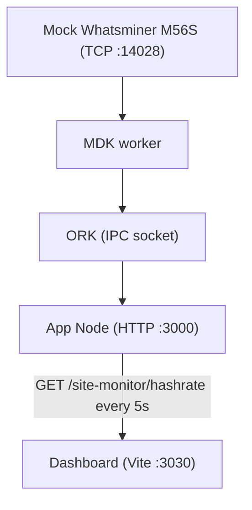

*Get started · 3 of 3 · Run the dashboard demo*

> [!NOTE]
> If ORK, worker, manager, or thing are unfamiliar, read [`terminology.md`][terminology] first.

## Overview

This is rung 3 of the [Get started][get-started] ladder: **run**. It puts a real browser dashboard on top of the stack you already know, using 
the [`mdk-site-monitor`][site-monitor-readme] example.

What you'll have at the end:

- The same mock Whatsminer M56S stack from [rung 2][cli-tutorial], fronted by an App Node REST API on `:3000`
- A React dashboard on `:3030` — total hashrate, total power, and active device count as metric cards, a live hashrate chart, and a per-device breakdown
- The dashboard polling App Node every 5 seconds, built entirely from MDK UI components (`MetricCard`, `HashRateLineChart`, `Typography`, ...)

> [!NOTE]
> Same shape as rungs 1 and 2: underneath, the stack still boots with `getOrk()`, `startWorker()`, and `registerThing()`, and the device is the same 
> Whatsminer M56S mock as [rung 2][cli-tutorial]. What's new is two layers on top — App Node translating MDK Protocol to REST, and a Vite React UI
> consuming that REST.

## Prerequisites

- Node.js >=24 (LTS)
- npm >=11

> [!IMPORTANT]
> The stack starts an ORK whose control plane is peer-to-peer over a Hyperswarm DHT, so it needs outbound network access. Without it the stack stalls 
> at startup while the ORK tries to reach DHT bootstrap nodes. See [how workers connect][workers-connect] 
> for the ORK/DHT mechanics.

<Steps>

<Step>

### Clone and install the stack

#### 1.1 Clone the repo

```bash
git clone git@github.com:tetherto/mdk.git
cd mdk
```

#### 1.2 Install dependencies

```bash
backend/core/install-packages.sh ci
backend/workers/install-packages.sh ci
```

</Step>

<Step>

### Build the UI packages (one time)

The dashboard imports pre-built MDK UI packages from `ui`. Build them once:

```bash
cd ui
npm install
npm run build
cd -
```

> [!NOTE]
> This is the slow step — it compiles the UI workspace. You only do it once; re-running the dashboard later skips straight to the next step.

</Step>

<Step>

### Install the dashboard's dependencies

```bash
cd examples/e2e/ui
npm install
cd -
```

</Step>

<Step>

### Start everything

`start.js` is an interactive launcher. From the repo root:

```bash
node examples/e2e/start.js
```

It prints the available services and a prompt. Type `start all` to launch the backend and UI together:

```
mdk> start all
```

This starts:

1. **App Node** (`server.js --app-node`) — ORK + mock Whatsminer + a REST API on `http://localhost:3000`, in `noAuth` mode
2. **UI** — a Vite dev server on `http://localhost:3030`, launched with `VITE_NO_AUTH=true` so it skips the login screen

Wait a few seconds for both to come up, then open:

```
http://localhost:3030
```

You'll see the dashboard populate within ~5 seconds (its first poll), then update live.

Other launcher commands:

```
status                       — show running services and their URLs
stop  [ork|app-node|ui|all]  — stop a service (default: all)
start [ork|app-node|ui|all]  — start a service (default: all)
help                         — show usage
exit                         — stop everything and quit
```

> [!WARNING]
> `start all` runs App Node in `noAuth` mode for development convenience. Do not expose port 3000 outside localhost.

</Step>

</Steps>

## What you'll see



The page renders three metric cards (Total Hashrate in TH/s, Total Power in W, Active Devices), a live hashrate line chart that grows as new data points 
arrive, and a per-device table. All of it comes from `@tetherto/mdk-react-devkit` components driven by the `@tetherto/mdk-react-adapter` data hooks — 
no hand-rolled UI. See [`SiteHashratePage.tsx`][site-hashrate-page] for the page source.

## Cleanup

At the launcher prompt:

```
mdk> exit
```

`exit` stops App Node, the mock, ORK, and the UI dev server. `server.js` leaves data under `os.tmpdir()/mdk/` — safe to ignore, or remove with:

```bash
rm -rf "$TMPDIR/mdk" /tmp/mdk
```

<details>
<summary>Add real auth (Google OAuth)</summary>

The `start all` shortcut above runs in `noAuth` mode so you can see the dashboard immediately. To exercise the real authentication flow — a Google 
sign-in that issues a bearer token the dashboard sends on every request — configure OAuth and start the services without the `noAuth` shortcut.

**1. Create a Google OAuth 2.0 client**

1. Go to [Google Cloud Console API credentials](https://console.cloud.google.com/apis/credentials)
2. Create an **OAuth 2.0 Client ID** (type: *Web application*)
3. Add to **Authorized redirect URIs**: `http://localhost:3000/oauth/google/callback`
4. Add to **Authorized JavaScript origins**: `http://localhost:3030`
5. Copy the **Client ID** and **Client Secret**

**2. Configure App Node**

Edit `backend/core/app-node/config/facs/httpd-oauth2.config.json` (copy from `.example` if it doesn't exist) and fill in your client ID and secret:

```json
{
  "h0": {
    "method": "google",
    "credentials": { "client": { "id": "<YOUR_CLIENT_ID>", "secret": "<YOUR_CLIENT_SECRET>" } },
    "startRedirectPath": "/oauth/google",
    "callbackUri": "http://localhost:3000/oauth/google/callback",
    "callbackUriUI": "http://localhost:3000",
    "users": []
  }
}
```

**3. Set yourself as super-admin**

In `backend/core/app-node/config/facs/auth.config.json`, set `superAdmin` to your Google account email:

```json
{ "a0": { "superAdmin": "you@example.com" } }
```

**4. Run with auth**

Start App Node and the UI without the `VITE_NO_AUTH` shortcut (run them directly rather than via `start all`), open `http://localhost:3030`, 
click **Sign in with Google**, and authorise with the super-admin email. The dashboard then shows live data behind the token.

For the full setup, see the example's [`README.md`][site-monitor-readme].

</details>

## Continue

Previous: [2. Control devices from the CLI][cli-tutorial]

You've climbed the whole ladder: observed a stack, driven it from a CLI, and built a live UI on it.

## Go deeper

- The [full example, including the OAuth setup and how to add a new data panel][site-monitor-readme]
- Learn more about [MDK UI toolkit (components, hooks, theming)][ui-usage]
- Run a full site (multiple workers and devices)[site-example]
- Read [all runnable examples in one place][examples-readme]

## Links

[terminology]: ../../concepts/terminology.md
<!-- docs@tether.io: terminology → concepts/terminology -->

[get-started]: index.md
<!-- docs@tether.io: get-started → tutorials/backend-stack -->

[cli-tutorial]: cli.md
<!-- docs@tether.io: cli-tutorial → tutorials/backend-stack/cli -->

[workers-connect]: ../../concepts/stack/workers.md
<!-- docs@tether.io: workers-connect → concepts/stack/workers -->

[site-monitor-readme]: ../../../examples/e2e/README.md
<!-- docs@tether.io: site-monitor-readme → https://github.com/tetherto/mdk/tree/main/examples/e2e -->

[site-hashrate-page]: ../../../examples/e2e/ui/src/SiteHashratePage.tsx
<!-- docs@tether.io: site-hashrate-page → https://github.com/tetherto/mdk/blob/main/examples/e2e/ui/src/SiteHashratePage.tsx -->

[ui-usage]: ../../../ui/README.md
<!-- docs@tether.io: ui-usage → https://github.com/tetherto/mdk/blob/main/ui/README.md -->

[site-example]: ../../../examples/backend/mdk-site/site.js
<!-- docs@tether.io: site-example → https://github.com/tetherto/mdk/blob/main/examples/backend/mdk-site/site.js -->

[examples-readme]: ../../../examples/backend/README.md
<!-- docs@tether.io: examples-readme → https://github.com/tetherto/mdk/blob/main/examples/backend/README.md -->
