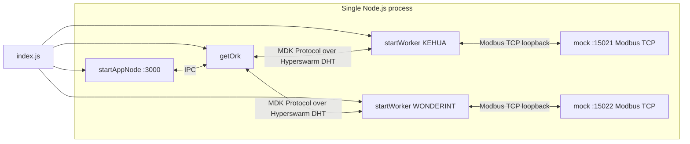

# MDK MicroBT Container Example

A small, self-contained **MicroBT container** site you can run with **no real hardware**.
One ORK and two MicroBT container workers — Kehua and Wonderint — all in a single Node.js process.
Each worker is backed by a **mock** MicroBT device speaking Modbus TCP, so the whole site comes up
on `localhost` and is immediately verifiable.

## What it demonstrates

- Bringing up an ORK + two workers in one process.
- Starting a **mock MicroBT container** per worker and **registering** it as a thing.
- Both MicroBT container types (Kehua, Wonderint) in one site.
- Live mock telemetry pulled through the ORK over the MDK Protocol — no hardware (see `verify.js`).

## Prerequisites

- **Node.js >= 24**
- Monorepo dependencies installed (from the repo root):

```bash
npm run setup:core      # backend/core packages
npm run setup:workers   # backend/workers packages (includes container-microbt + its mock)
```

> Without these the example fails at startup with `Cannot find module 'debug'` (or similar). This is
> the most common first-run problem — install before anything else.

## Architecture



Each worker polls its mock over the Modbus TCP protocol on loopback, exactly as it would poll a real
MicroBT container. An HTTP app node sits in front of the ORK and exposes a REST API at
`http://localhost:3000`.

## Workers and mocks

| Worker class | Mock type | Mock port | `serialNum` | `container` |
|---|---|---|---|---|
| `MBT_KEHUA`    | `kehua`    | 15021 | `MBT001` | `mbt-k-1` |
| `MBT_WONDERINT`| `wonderint`| 15022 | `MBT002` | `mbt-w-1` |

Both devices are registered with `username: 'admin'` / `password: 'admin'`.

## Quickstart

```bash
node examples/backend/containers/microbt/index.js     # from the repo root
# or: cd examples/backend/containers/microbt && npm start
```

On startup the ORK HRPC key, the HTTP server URL, and each registered device ID are printed. After
~20–30 s both workers have joined the DHT and their devices are live. `Ctrl+C` shuts everything
down cleanly.

## Verifying it works

With the example running in one terminal, run `verify.js` in another:

```bash
node examples/backend/containers/microbt/verify.js
# or from the example dir: npm run verify
```

It polls the HTTP API exposed by the app node (`http://localhost:3000`) and, for each worker,
prints the discovered device plus **live mock telemetry**:

```
ORK sees 2 worker(s):

  MicroBTManagerKehua-...  state=READY health=HEALTHY devices=1
    └─ 3a3eb06e-...
         power_w=1247080
  MicroBTManagerWonderint-...  state=READY health=HEALTHY devices=1
    └─ 5f1cb72a-...
         power_w=1247760

OK — MicroBT container site is live and serving telemetry over HTTP.
```
