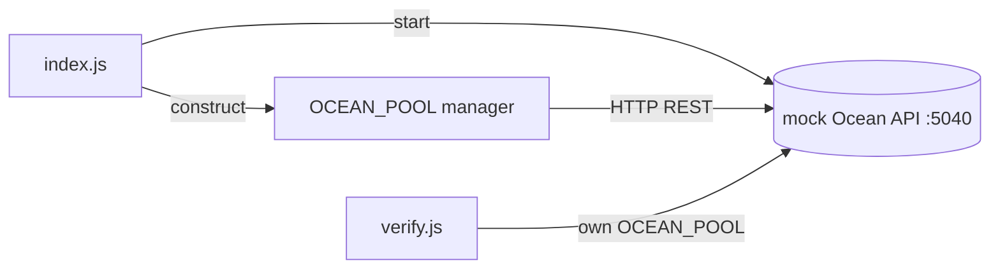

# MDK Ocean Minerpool Example (standalone)

A small, self-contained **Ocean** minerpool example you can clone and run with **no real hardware,
no Ocean.xyz account, and no network access**. It starts a mock Ocean API, drives the `OCEAN_POOL`
Worker against it, and prints a live pool snapshot (hashrate, Workers, balance, transactions,
blocks). It then stays running so `verify.js` can re-query the same mock.

## Why this one is standalone (no Kernel / gateway)

The miner and container examples (e.g. [`examples/backend/miners/antminer`](../../miners/antminer/README.md))
bring up an Kernel + gateway and register devices as **things**. **Minerpools are different** and are
**not yet wired into the Kernel/MDK thing model:**

- `OceanMinerpoolManager` extends `MinerpoolManager` (an `EventEmitter`), **not** `ThingManager`. It
  has no `registerThing`, no `mem.things`, no `getThingType`.
- It's **config-driven**: the pool accounts and API URL come from `{ ocean: { accounts, apiUrl } }`
  at construction, and data is pulled with `fetchStats` / `fetchWorkers` / `fetchTransactions` /
  `fetchBlocks`.
- `startWorker()` constructs every manager with an empty conf and `MDKWorkerAdapter` is hard-wired to
  the `ThingManager` API (`mem.things`, `listThings`, `collectThingSnap`), so a minerpool can't be
  started under the Kernel today.

So this example drives the pool manager **directly**, exactly as it runs inside a Worker process.
Wiring minerpools into the Kernel (conf injection in `startWorker` + a minerpool path in the adapter)
is the **"MDK integration"** half of the parent task and is tracked separately. Once that lands, this
example can grow an Kernel + `verify`-over-HRPC flow like the miner examples.

## What it demonstrates

- Running the `OCEAN_POOL` Worker against a mock Ocean.xyz REST API — zero hardware/account.
- Pulling pool **stats**, per-worker **hashrate**, **transactions** and **blocks** into the Worker store.
- Reading those back via `getWrkExtData()` / `getWorkers()`.

## Prerequisites

- **Node.js >= 24**
- Worker dependencies installed (from the repo root):

```bash
npm run setup:workers   # backend/workers packages (includes minerpool-ocean + its mock)
```

> Without this you'll get `Cannot find module ...` on first run.

## Architecture



`index.js` owns the mock; `verify.js` is a second process that spins up its own `OCEAN_POOL` against
the same mock. No Kernel, no gateway, no DHT.

## Quickstart

Clone-and-run — no config copy needed (falls back to `config/mdk.config.json.example`):

```bash
node examples/backend/minerpools/ocean/index.js     # from the repo root
# or: cd examples/backend/minerpools/ocean && npm start
```

You'll see a pool snapshot, then `Press Ctrl+C to stop`. To customise (port, accounts), copy the
example and edit your own copy — it takes precedence:

```bash
cd examples/backend/minerpools/ocean
cp config/mdk.config.json.example config/mdk.config.json
```

## Verifying it works

With `index.js` running in one terminal, run the check in another:

```bash
node verify.js        # or: npm run verify
```

It builds its own `OCEAN_POOL` against the running mock and prints per-account stats plus each
Worker's hashrate:

```
Ocean account: test
  hashrate: 5m=103.80 TH/s 1h=102.30 TH/s 24h=100.50 TH/s
  workers:  6 total, 5 online
  balance:  0 BTC   (est. today 0 BTC)
    └─ test.worker1  online=1  109.70 TH/s
    ...
OK — Ocean pool Worker is fetching live data from the mock API.
```

(The mock returns randomised values per run, so exact numbers vary.)

## Configuration reference

`config/mdk.config.json` (copied from the `.example`):

| Field | Description |
|---|---|
| `mock.host` | Interface the mock Ocean API binds (default `127.0.0.1`). |
| `mock.port` | Port for the mock API (default `5040`). Also the URL the pool fetches from. |
| `accounts` | Ocean account usernames to query. The mock serves canned data for any name (default `["test"]`). |

## How it works

`index.js`:

1. Starts the mock Ocean API (`backend/workers/minerpools/ocean/mock/server`).
2. Constructs `new OCEAN_POOL({ ocean: { accounts, apiUrl } }, { rack, storeDir, root })` and `init()`s it.
3. Pulls data: `fetchWorkers` → `fetchStats` → `fetchTransactions` → `fetchBlocks` (stored in a local Hyperbee).
4. Reads it back: `getWrkExtData({ key: 'stats' | 'transactions' | 'blocks' })` and `getWorkers()`.
5. Stays running (keeps the mock up) until `Ctrl+C`, then stops the pool and closes the mock.

## Directory layout

### Committed (source)

```
examples/backend/minerpools/ocean/
├── README.md
├── package.json
├── index.js                      # mock + OCEAN_POOL + fetch/print, stays running
├── verify.js                     # fresh OCEAN_POOL against the running mock
├── config/
│   └── mdk.config.json.example
└── .gitignore
```

### Generated (ignored)

```
examples/backend/minerpools/ocean/
└── config/mdk.config.json        # your copy of the .example (optional — falls back to .example)

$TMPDIR/mdk-site-ocean/store/     # the pool's Hyperbee store
```

## Troubleshooting

| Issue | Fix |
|---|---|
| `Cannot find module ...` | Run `npm run setup:workers` from the repo root. |
| `verify.js` errors with `ECONNREFUSED` | Start `index.js` first — it owns the mock the verifier queries. |
| `EADDRINUSE :::5040` | A previous run is still bound. `Ctrl+C` it, or change `mock.port`. |
| All metrics `n/a`/`0` | The mock randomises data; re-run. If persistent, confirm the mock is reachable at `mock.host:mock.port`. |

## Related

| Path | Purpose |
|---|---|
| [`backend/workers/minerpools/ocean`](../../../../backend/workers/minerpools/ocean/README.md) | Ocean `OCEAN_POOL` manager, mock server, `mdk-contract.json`. |
| [`examples/backend/minerpools/mdk.client.ocean.js`](../mdk.client.ocean.js) | The minimal single-file version of this example. |
| [`examples/backend/miners/antminer`](../../miners/antminer/README.md) | An Kernel-integrated example (for comparison — what minerpools will look like once integrated). |
