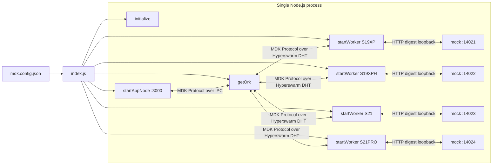

# MDK Antminer Example (single-process)

A small, self-contained **Antminer** mining site you can clone and run with **no real hardware**.
One ORK, one HTTP app-node, and four Antminer workers — S19 XP, S19 XP Hydro, S21, and S21 Pro —
all in a single Node.js process. Each worker is backed by a **mock** Antminer device, so the whole
site comes up on `localhost` and is immediately curl-able.

This is the Antminer-specific counterpart of the brand-agnostic
[`examples/backend/site-single-process`](../../site-single-process/README.md). If
you're new to MDK, start there for the orchestration mechanics; this example layers the **mock
device + registration** half on top so the API actually returns miners.

## What it demonstrates

- Bringing up ORK + app-node + N workers in one process (single-process mode).
- Starting a **mock Antminer** per worker and **registering** it as a thing.
- The full Antminer model family (S19XP, S19XPH, S21, S21PRO) in one site.
- Live mock telemetry pulled through the ORK over the MDK Protocol — no hardware (see `verify.js`).

## Prerequisites

- **Node.js >= 24**
- Monorepo dependencies installed (from the repo root):

```bash
npm run setup:core      # backend/core packages
npm run setup:workers   # backend/workers packages (includes miner-antminer + its mock)
```

> Without these the example fails at startup with `Cannot find module 'debug'` (or similar). This is
> the most common first-run problem — install before anything else.

## Architecture



The mocks are the only addition over `site-single-process`: each worker polls its mock over
Bitmain's HTTP digest API on loopback, exactly as it would poll a real Antminer.

## The four Antminer models

| Service | `type` | Mock `type` | Mock port | Auth |
|---|---|---|---|---|
| `am-s19xp`   | `S19XP`   | `s19xp`   | 14021 | digest `root` / `root` |
| `am-s19xph`  | `S19XPH`  | `s19xp_h` | 14022 | digest `root` / `root` |
| `am-s21`     | `S21`     | `s21`     | 14023 | digest `root` / `root` |
| `am-s21pro`  | `S21PRO`  | `s21pro`  | 14024 | digest `root` / `root` |

> Note the `S19XPH` → `s19xp_h` mapping: the registry/manager key is `S19XPH` but the mock and its
> initial-state files use the underscored `s19xp_h`. `index.js` translates this via `ANTMINER_MOCK_TYPE`.

## Quickstart

Clone-and-run — no config copy needed (the example falls back to
`config/mdk.config.json.example`):

```bash
node examples/backend/miners/antminer/index.js     # from the repo root
# or: cd examples/backend/miners/antminer && npm start
```

To customise (ports, models, serials), copy the example and edit your own copy — it takes
precedence over the `.example`:

```bash
cd examples/backend/miners/antminer
cp config/mdk.config.json.example config/mdk.config.json
```

After ~40s (each worker joins the DHT in turn) you'll see `ORK sees 4 worker(s)` and the registered
devices with their mock ports. `Ctrl+C` shuts everything down cleanly (mocks, workers, app-node, ORK).

## Verifying it works (MDK Protocol over IPC)

The reliable, integrated way to confirm the site is live is `verify.js`. With the example running
in one terminal, run it in another:

```bash
node verify.js        # or: npm run verify
```

It connects to the ORK's IPC socket over the MDK Protocol and, for each of the four Antminer
workers, prints the discovered device plus its capabilities and **live mock telemetry**:

```
ORK sees 4 worker(s):

  AntminerManagerS19xp-rack-s19xp  state=READY health=HEALTHY devices=1
    └─ 3a3eb06e-...  capabilities: 9 telemetry, 11 commands
         status=mining hashrate_mhs.avg=292859395760 pools=3
  ... (S19XPH, S21, S21PRO) ...

OK — Antminer site is live and serving telemetry over the MDK Protocol.
```

## Hitting the HTTP API with curl

The config ships `"noAuth": true` to make `/auth/*` curl-able without a JWT
(**dev only; never enable beyond localhost**). What works today:

```bash
curl http://localhost:3000/auth/site          # ✅ {"site":"SITE_NAME"}
```

> **Heads-up — the device data routes are not wired up yet.** `/auth/list-things`, `/auth/miners`
> and `/auth/permissions` do **not** return data in this build:
>
> - The app-node's data proxy still calls legacy per-method ORK RPCs (`listThings`, `listRacks`,
>   …), but the MDK ORK exposes a single MDK-Protocol `mdk` method dispatched by action
>   (`worker.list`, `telemetry.pull`, …) — so those calls return `UNKNOWN_METHOD`.
> - In `noAuth` mode the app-node skips building `authLib`, so the permission-gated routes throw.
>
> Both are **app-node ↔ ORK integration work tracked under the parent task "MDK integration of
> workers"** — out of scope for this sample. Until that lands, use `verify.js` above to exercise
> the live devices over the MDK Protocol. This example will gain working `/auth/miners` curls for
> free once the parent integration is merged.

## Configuration reference

`config/mdk.config.json` (copied from the `.example`):

| Field | Description |
|---|---|
| `mode` | Must be `"single-process"`. |
| `env` | `"development"` or `"production"` (default `development`). |
| `noAuth` | `true` disables JWT auth on `/auth/*`. Dev only. |
| `services[]` | Ordered list — `ork` **must come first**, then `app-node`, then workers. |

Each worker entry:

| Field | Description |
|---|---|
| `worker` | `"miner-antminer"` — maps to `backend/workers/miners/antminer` via `WORKER_PACKAGES`. |
| `type` | One of `S19XP`, `S19XPH`, `S21`, `S21PRO` — maps to a manager class via `WORKER_REGISTRY`. |
| `rack` | Rack id; also the per-worker data dir under `data/`. |
| `mock` | Mock + registration parameters (below). |

The `mock` block:

| Field | Used for |
|---|---|
| `port` | Mock HTTP port; also the device's registered `port`. |
| `serialNum` | Mock serial **and** the registered `info.serialNum`. |
| `container`, `pos` | Registration `info` metadata. |
| `username`, `password` | Digest credentials, shared by mock and registration (default `root`/`root`). |

**Adding a model:** add a `WORKER_REGISTRY` entry (`miner-antminer:<TYPE>` → manager export), an
`ANTMINER_MOCK_TYPE` entry, and a worker service block with a unique `port`, `serialNum` and `rack`.

## How mocks + registration work

For each `worker` service, `index.js`:

1. `resolveManagerClass(worker, type)` → loads the manager from `backend/workers/miners/antminer`.
2. `startWorker(ManagerClass, { ork, rack, ... })` → boots the worker and joins the ORK's DHT topic.
3. `startMock(svc)` → binds the Antminer mock on `mock.port` (kept in `mockHandles` for cleanup).
4. `manager.registerThing({ info, opts })` → registers the mock as a device on that worker.

One device per worker keeps every mock on `127.0.0.1` without tripping the duplicate-IP guard in
`MinerManager` (validation is per-manager, so distinct workers may reuse the loopback address).

## Directory layout

### Committed (source)

```
examples/backend/miners/antminer/
├── README.md
├── package.json
├── index.js                      # orchestration: ORK + app-node + workers + mocks + registration
├── verify.js                     # functional check over the MDK Protocol (IPC)
├── config/
│   └── mdk.config.json.example
└── .gitignore
```

### Generated (ignored)

```
examples/backend/miners/antminer/
├── config/mdk.config.json        # your copy of the .example (optional — falls back to .example)
└── data/rack-<name>/             # per-worker store

$TMPDIR/mdk-site-antminer/
├── ork/                          # ORK Corestore + ork.sock
└── app-node/                     # app-node config/store
```

ORK and app-node are pinned to **sibling** dirs under `$TMPDIR/mdk-site-antminer/` — Hypercore
storage can't tolerate one Corestore nested under another in the same process.

## Troubleshooting

| Issue | Fix |
|---|---|
| `Cannot find module 'debug'` (or similar) | Run `npm run setup:core` and `npm run setup:workers` from the repo root. |
| `Cannot find module './config/mdk.config.json'` | `cp config/mdk.config.json.example config/mdk.config.json` first. |
| `ERR_ORK_REQUIRED` | Keep the `ork` service entry above `app-node`/workers in the config. |
| `ERR_WORKER_UNKNOWN: no manager for X:Y` | `worker:type` not in `WORKER_REGISTRY`. Use a supported pair or add it. |
| `ERR_UNSUPPORTED` from the mock | `type` isn't one of `s19xp`/`s19xp_h`/`s21`/`s21pro`. Check `ANTMINER_MOCK_TYPE`. |
| `EADDRINUSE :::3000` or `:::1402x` | A previous run is still bound. `Ctrl+C` it, or kill the process holding the port. |
| `ERR_THING_SERIALNUM_EXISTS` | Two services share a `serialNum`. Make them unique. |
| `Corruption: ... MANIFEST-* may be corrupted` | Stale store from a `kill -9`. Delete `data/` and `$TMPDIR/mdk-site-antminer/` and retry. |

## Related

| Path | Purpose |
|---|---|
| [`backend/core/mdk`](../../../../backend/core/mdk/index.js) | `initialize()`, `getOrk()`, `startAppNode()`, `startWorker()`. |
| [`backend/workers/miners/antminer`](../../../../backend/workers/miners/antminer/README.md) | Antminer managers, mock server, `mdk-contract.json`, `USAGE.md`. |
| [`examples/backend/site-single-process`](../../site-single-process/README.md) | Brand-agnostic single-process site this example builds on. |
