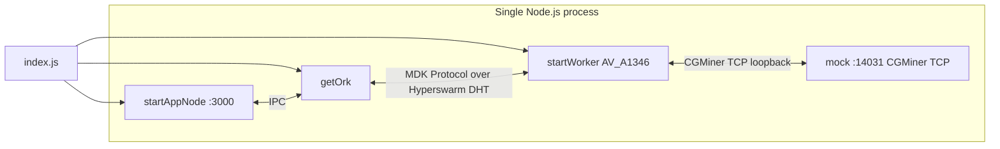

# MDK Avalon Miner Example

A small, self-contained **Avalon A1346 miner** site you can run with **no real hardware**.
One ORK and one Avalon A1346 worker in a single Node.js process, backed by a **mock** Avalon
device speaking CGMiner's TCP protocol, so the whole site comes up on `localhost` and is
immediately verifiable.

## What it demonstrates

- Bringing up an ORK + one worker in one process.
- Starting a **mock Avalon A1346 miner** and **registering** it as a thing.
- Exposing the ORK via an **HTTP app node** at `http://localhost:3000`.
- Live mock telemetry pulled through the ORK over HTTP — no hardware.

## Prerequisites

- **Node.js >= 24**
- Monorepo dependencies installed (from the repo root):

```bash
npm run setup:core      # backend/core packages
npm run setup:workers   # backend/workers packages (includes miner-avalon + its mock)
```

> Without these the example fails at startup with `Cannot find module 'debug'` (or similar). This is
> the most common first-run problem — install before anything else.

## Architecture



The worker polls its mock over CGMiner's TCP protocol on loopback, exactly as it would poll a
real Avalon miner. An HTTP app node sits in front of the ORK and exposes a REST API at
`http://localhost:3000`.

## Workers and mocks

| Worker class | Mock type | Mock port | `serialNum` | `container` |
|---|---|---|---|---|
| `AV_A1346` | `a1346` | 14031 | `AV001` | `av-1` |

The device is registered with `password: 'admin'`.

## Quickstart

```bash
node examples/backend/miners/avalon/index.js     # from the repo root
# or: cd examples/backend/miners/avalon && npm start
```

On startup the ORK HRPC key, the HTTP server URL, and the registered device ID are printed. After
~20–30 s the worker has joined the DHT and its device is live. `Ctrl+C` shuts everything down
cleanly.

## Verifying it works

Once the example is running, query the HTTP API exposed by the app node (`http://localhost:3000`)
directly. For example, to list workers and pull telemetry for a device:

```bash
curl http://localhost:3000/site-monitor/workers
curl http://localhost:3000/site-monitor/devices/<device-id>/telemetry
```

A healthy response from the workers endpoint looks like:

```json
{
  "workers": [
    {
      "workerId": "AvalonMinerManagerA1346-...",
      "state": "READY",
      "healthState": "HEALTHY",
      "deviceIds": ["<device-id>"]
    }
  ]
}
```
