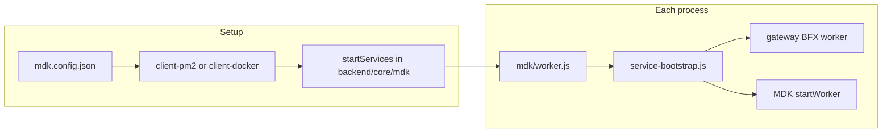

# MDK Site Example

Example deployment of an MDK site in **microservices** mode: one HTTP gateway and multiple miner Workers run as separate processes, orchestrated by **PM2** or **Docker**.

> [!IMPORTANT]
> This example starts only the Gateway and Worker processes. Kernel must already be running and its public key
> must be available at `DEFAULT_KEY_FILE` (`<tmpdir>/mdk/.kernel-key`) or passed explicitly via `kernelKey`.
> For a complete example that starts every service — including Kernel — see
> [`examples/site-backend/`](../../site-backend/README.md).

## Prerequisites

- **Node.js** >= 24
- **PM2** (for local process management): `npm install -g pm2`
- **Docker** + **Docker Compose** (for container runtime)
- Monorepo dependencies installed:

```bash
cd backend/core && npm run install:packages
cd backend/workers && npm run install:packages
```

## Site configuration

Copy and edit the site config:

```bash
cp config/mdk.config.json.example config/mdk.config.json
```

| Field | Description |
|-------|-------------|
| `mode` | Must be `"microservices"` |
| `runtime` | `"pm2"` or `"docker"` — used by `index.js` when no client script is passed |
| `image` | Docker image name (Docker only), e.g. `"site-mdk"` |
| `env` | Optional. `"development"` or `"production"` (default: `development`) |
| `shouldAutoStart` | If `true`, setup also starts services (PM2 or Compose) |
| `services` | List of processes to run (see below) |

### Default services

| Name | Kind | Role |
|------|------|------|
| `gateway` | `gateway` | HTTP API on port `3000` |
| `wm-m56s` | `worker` | Whatsminer M56S Worker (`miner-whatsminer`) |
| `am-s19xp` | `worker` | Antminer S19XP Worker (`miner-antminer`) |

Worker entries require `worker`, `type`, and `rack` fields.

---

## Directory layout

### Committed (source)

```
examples/backend/site/
├── README.md                 # This file
├── package.json              # Site npm scripts
├── index.js                  # Dispatches to PM2 or Docker client by config.runtime
├── client-pm2.js             # Setup for PM2
├── client-docker.js          # Setup for Docker
├── Dockerfile                # Base image for Docker runtime
├── docker-entrypoint.sh      # Container entry: install deps + run worker
├── config/
│   └── mdk.config.json.example
└── .gitignore
```

### Generated (do not commit)

Created when you run setup (`client-pm2.js`, `client-docker.js`, or `npm run setup:*`). Listed in `.gitignore`.

```
examples/backend/site/
├── config/
│   └── mdk.config.json       # Your local config (copy from .example)
├── mdk/                      # Runtime entrypoints (copied from backend/core/mdk)
│   ├── worker.js             # Process launcher
│   └── utils/
│       └── service-bootstrap.js   # Starts gateway or worker from env vars
├── ecosystem.config.js       # PM2 only — one app per service
├── docker-compose.generated.yml  # Docker only — one container per service
└── data/                     # Per-Worker runtime data (created at run time)
    └── rack-<name>/          # Store, config copies per Worker rack
```

Repo-level files touched by setup (not in this folder):

- `tmp/` — MDK initialize layout (configs, Worker stubs) under repo root
- `backend/core/gateway/config/` — config files copied from `.example` when missing

---

## How it works

All services share the same entry script: `mdk/worker.js`. Environment variables select what runs:

| Variable | `gateway` | Worker (e.g. wm-m56s) |
|----------|------------|------------------------|
| `SERVICE` | `gateway` | `worker` |
| `PORT` | `3000` | — |
| `WORKER` | — | `miner-whatsminer` |
| `TYPE` | — | `M56S` |
| `RACK` | — | `rack-m56s` |
| `MDK_ENV` | `development` / `production` | same |

`service-bootstrap.js` reads these and either spawns the gateway BFX Worker or calls MDK `startWorker()` for the matching miner manager.



---

## PM2

### 1. Install site dependencies

```bash
cd examples/backend/site
npm install
```

### 2. Configure

```bash
cp config/mdk.config.json.example config/mdk.config.json
# Set "runtime": "pm2" in mdk.config.json (client-pm2.js forces this anyway)
```

### 3. Setup (required before first start)

Generates `mdk/`, `ecosystem.config.js`, and prepares repo config:

```bash
npm run setup:pm2
# or: node client-pm2.js
```

### 4. Start services

```bash
pm2 start ecosystem.config.js
```

### 5. Inspect / stop

```bash
pm2 list
pm2 logs
pm2 stop ecosystem.config.js
pm2 delete ecosystem.config.js
```

### One-liner

```bash
npm run start:pm2
```

Runs setup then `pm2 start`.

### PM2 process names

| PM2 name | Service |
|----------|---------|
| `mdk-gateway` | HTTP gateway |
| `mdk-wm-m56s` | Whatsminer Worker |
| `mdk-am-s19xp` | Antminer Worker |

---

## Docker

### 1. Install site dependencies

```bash
cd examples/backend/site
npm install
```

### 2. Configure

```bash
cp config/mdk.config.json.example config/mdk.config.json
# image must match the tag you build, e.g. "site-mdk"
```

### 3. Build image (once)

From **repo root**:

```bash
docker build -f examples/backend/site/Dockerfile -t site-mdk .
```

Or from the site folder:

```bash
npm run docker:build
```

### 4. Setup

```bash
npm run setup:docker
# or: node client-docker.js
```

Writes `mdk/`, `docker-compose.generated.yml`, etc.

### 5. Start containers

```bash
docker compose -f docker-compose.generated.yml up -d
```

**First start** runs `docker-entrypoint.sh`, which:

1. Runs `install-packages.sh ci` in `backend/core` and `backend/workers` (Linux `node_modules` inside the container)
2. Executes `node mdk/worker.js` with the env vars from Compose

### 6. Inspect / stop

```bash
docker compose -f docker-compose.generated.yml ps
docker compose -f docker-compose.generated.yml logs -f
docker compose -f docker-compose.generated.yml down
```

### One-liner

```bash
npm run start:docker
```

### Compose services

| Compose service | Port | Role |
|-----------------|------|------|
| `gateway` | `3000:3000` | HTTP API |
| `wm-m56s` | — | Whatsminer Worker |
| `am-s19xp` | — | Antminer Worker |

The repo is bind-mounted at `/app/repo` so code changes apply without rebuilding the image (restart containers to pick up changes).

---

## npm scripts

| Script | Description |
|--------|-------------|
| `setup:pm2` | Generate PM2 config and `mdk/` runtime files |
| `setup:docker` | Generate Compose file and `mdk/` runtime files |
| `start:pm2` | Setup + `pm2 start ecosystem.config.js` |
| `start:docker` | Setup + `docker compose up -d` |
| `stop:docker` | `docker compose down` |
| `docker:build` | Build `site-mdk` image from repo root |

---

## Troubleshooting

| Issue | What to check |
|-------|----------------|
| `Script not found: .../mdk/worker.js` | Run `npm run setup:pm2` or `setup:docker` first |
| PM2 shows one process named `ecosystem.config` | Use `ecosystem.config.js` filename (must contain `.config.js`) |
| PM2/Docker restarts immediately | Run `pm2 logs` or `docker compose logs`; ensure `backend/core` and `backend/workers` deps are installed |
| Docker native module errors | Let entrypoint finish first-run `npm ci` in core/Workers, or run install scripts on the host and recreate containers |
| `Cannot find module './utils/service-bootstrap'` | Re-run setup to refresh `mdk/` copies |

---

## Related packages

| Path | Purpose |
|------|---------|
| `backend/core/mdk` | `startServices()`, config generation, `service-bootstrap.js` |
| `backend/core/gateway` | HTTP worker (spawned for `SERVICE=gateway`) |
| `backend/workers/miners/*` | Miner manager implementations |
| `backend/core` / `backend/workers` | Run `npm run install:packages` before site setup |
