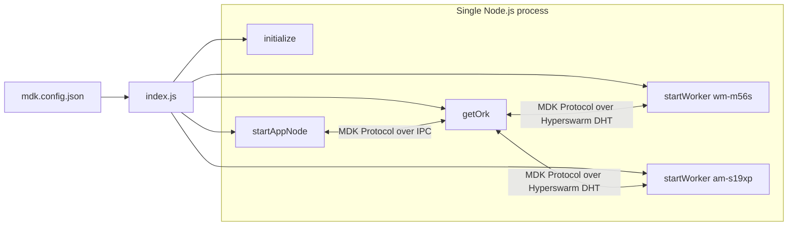

# MDK Site Example (single-process)

Example deployment of an MDK site in **single-process** mode: one HTTP app-node and N miner workers run inside the same Node.js process — no PM2, no Docker. Useful for local development, demos, and minimal-footprint deployments.

For the multi-process (PM2 or Docker) deployment, see [`examples/core/site`](../site/README.md).

## Prerequisites

- **Node.js** >= 24
- Monorepo dependencies installed:

```bash
cd backend/core && npm run install:packages
cd backend/workers && npm run install:packages
```

## Site configuration

Copy and edit the site config:

```bash
cp config/mdk.config.json.example config/mdk.config.json
```

| Field | Description |
|-------|-------------|
| `mode` | Must be `"single-process"` |
| `env` | Optional. `"development"` or `"production"` (default: `development`) |
| `noAuth` | Optional. Set `true` to disable JWT auth on `/auth/*` routes — useful for smoke-testing endpoints with plain `curl`. Default: `false`. **Dev only — never enable in production.** |
| `services` | List of services to start in this process (see below) |

### Default services

| Name | Kind | Role |
|------|------|------|
| `ork` | `ork` | Orchestration Kernel — must come first; required by `app-node` and workers |
| `app-node` | `app-node` | HTTP API on port `3000` |
| `wm-m56s` | `worker` | Whatsminer M56S worker (`miner-whatsminer`) |
| `am-s19xp` | `worker` | Antminer S19XP worker (`miner-antminer`) |

Worker entries require `worker`, `type`, and `rack` fields. Supported `worker:type` pairs are listed in `WORKER_REGISTRY` at the top of `index.js`; mirror that map if you add a manager class to `backend/workers/`.

The `ork` entry must appear before any `app-node` or `worker` entry — both depend on the orchestrator being up. The example bails with `ERR_ORK_REQUIRED` if they're declared out of order.

---

## Directory layout

### Committed (source)

```
examples/core/site-single-process/
├── README.md                 # This file
├── package.json              # Site npm scripts
├── index.js                  # In-process orchestration entry
├── config/
│   └── mdk.config.json.example
└── .gitignore
```

### Generated (do not commit)

```
examples/core/site-single-process/
├── config/
│   └── mdk.config.json       # Your local config (copy from .example)
└── data/                     # Per-worker runtime data (created at run time)
    └── rack-<name>/          # Per-rack store

$TMPDIR/mdk-site-single-process/
├── ork/                      # ORK's Corestore + IPC socket
│   ├── store/ork-db/
│   └── ork.sock
└── app-node/                 # App-node's config/store
    ├── config/facs/
    └── ...
```

ORK and app-node are pinned to sibling directories under `$TMPDIR/mdk-site-single-process/` — Hypercore's storage can't tolerate one Corestore directory being nested under another in the same process, and the framework defaults put ORK at `$TMPDIR/mdk/` with app-node at `$TMPDIR/mdk/app-node/`. The example overrides both roots to disjoint sibling paths.

`initialize()` also creates a repo-level `tmp/` layout (configs, worker stubs) under the monorepo root.

---

## How it works

`index.js` reads `config/mdk.config.json`, calls `initialize()` once, then walks `services[]` and dispatches each entry to the matching programmatic API exported from `backend/core/mdk`:



All five layers run in one Node.js heap but still talk over the real MDK Protocol — the surface behaviour is identical to the microservices example from a client's perspective.

The app-node connects to ORK over an IPC Unix socket (`DEFAULT_IPC_SOCK` in `backend/core/mdk`); workers and ORK find each other through a single Hyperswarm DHT topic generated at boot. After `startWorker` is called for every entry, the example polls `waitForDiscovery` for up to 10 s and prints how many workers ORK sees.

Cleanup is centralised through `ork._cleanup` (populated by `startAppNode` and `startWorker`) and walked in reverse start order on `SIGINT` / `SIGTERM`, followed by `ork.stop()`.

---

## Quickstart

```bash
cd examples/core/site-single-process
cp config/mdk.config.json.example config/mdk.config.json
node index.js
```

That's it. `Ctrl+C` shuts everything down cleanly.

`npm start` also works.

### Hitting the API without a token

Set `"noAuth": true` in `mdk.config.json` to skip JWT validation on `/auth/*` routes. Then:

```bash
curl http://localhost:3000/auth/site
curl http://localhost:3000/auth/list-things
curl http://localhost:3000/auth/miners
curl http://localhost:3000/auth/permissions
```

Leave `noAuth` off (or remove it) for any deployment that's exposed beyond `localhost`.

---

## When to use single-process vs microservices

| Use single-process when | Use microservices ([`examples/core/site`](../site/README.md)) when |
|---|---|
| Local development or demos | Production sites |
| Tests need a self-contained site | You need per-service restart isolation |
| Minimal-footprint embedded deployments | You're orchestrating many workers across hosts |
| You don't need supervisor-managed restarts | A worker crash must not take down the app-node |

---

## Troubleshooting

| Issue | What to check |
|-------|----------------|
| `Cannot find module './config/mdk.config.json'` | Run `cp config/mdk.config.json.example config/mdk.config.json` first |
| `ERR_ORK_REQUIRED: declare an "ork" service before ...` | Move the `ork` service entry above any `app-node`/`worker` entries in `mdk.config.json` |
| `ERR_WORKER_UNKNOWN: no manager for X:Y` | `worker:type` pair not in `WORKER_REGISTRY`. Add the entry locally or use a supported pair |
| `ERR_WORKER_PACKAGE: unknown worker package` | `worker` field doesn't map to a path in `WORKER_PACKAGES`. Add it to the local map |
| `EADDRINUSE :::3000` | Port 3000 is taken. Change `services[].port` in your config |
| `Corruption: IO error ... MANIFEST-* may be corrupted` | Stale worker store from an abrupt kill. Delete `data/` and retry. (Clean `Ctrl+C` flushes properly — only `kill -9` should leave you in this state.) |
| `Corestore is closed` during app-node startup | A second Corestore was opened at a path nested under another. This example pins ORK and app-node to disjoint roots — if you fork, keep them sibling directories |
| Native module errors | Re-run `install-packages.sh` in `backend/core` and `backend/workers` |
| Workers never register (ORK sees 0) | DHT topic mismatch — confirm `index.js` shares a single `orkTopic` across all workers (it does by default; relevant if you fork the file) |

---

## Related packages

| Path | Purpose |
|------|---------|
| `backend/core/mdk` | `initialize()`, `startAppNode()`, `startWorker()` — the programmatic APIs this example consumes |
| `backend/core/app-node` | HTTP worker spawned by `startAppNode()` |
| `backend/workers/miners/*` | Miner manager implementations resolved by `resolveManagerClass()` |
