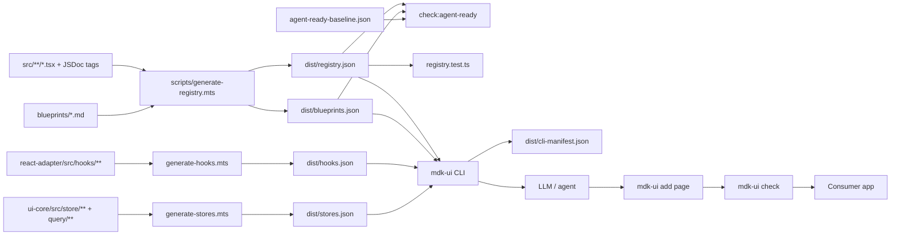
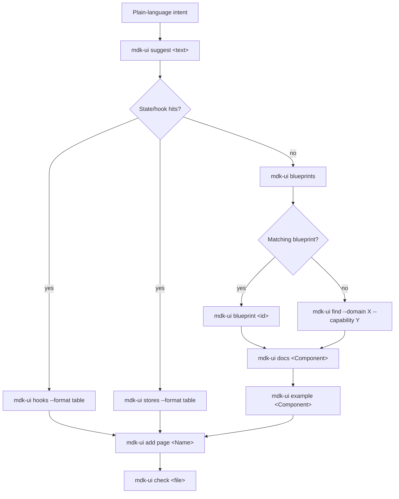

# Agent-first architecture

The MDK monorepo is set up so AI agents can build features from
plain-language intents without parsing the package source. This page is
both the **quickstart** (how to test it in 30 seconds) and the
**architecture tour** (how every piece fits together), plus the
**end-to-end recipe** for running the `mdk-ui-shell` template against a
real backend.

It is intentionally not the contract — the strict contract lives in
[`../packages/react-devkit/AGENT_READY.md`](../packages/react-devkit/AGENT_READY.md).

## TL;DR

- **Write code** → add JSDoc with `@tier` + `@category` + `@domain`.
- **If `agent-ready`** → also ship `USAGE.md` + `*.example.tsx` (+
  `@orkCapability` if domain-specific).
- **`npm run fullcheck`**: when green, the repo is shippable.
- **Agents** run `mdk-ui suggest` first, then drill into hooks/stores,
  docs, examples, and blueprints — all local, no network.
- **`mdk-ui init`** bootstraps any consumer project with an agent-context
  file and an IDE rule that wires every session automatically.
- **Baseline is empty** → should be empty in CI; run
  `npm run check:agent-ready --workspace @tetherto/mdk-react-devkit -- --no-baseline`
  locally to see full debt.

## What this is

MDK is a mining UI toolkit. We made it so an **AI agent** (Cursor,
Claude, etc.) can read a small set of JSON files, understand every
component, hook, and store, and scaffold real features without guessing.

It ships three TypeScript packages and one font package:

- [`@tetherto/mdk-ui-core`](../packages/ui-core/README.md) — framework-agnostic
  state (Zustand stores), the command lifecycle state machine, telemetry
  primitives.
- [`@tetherto/mdk-react-adapter`](../packages/react-adapter/README.md) — React
  bindings for the stores and TanStack Query.
- [`@tetherto/mdk-react-devkit`](../packages/react-devkit/README.md) — the
  component library: generic UI primitives in `src/core/`, mining-domain
  components and hooks in `src/foundation/`.

Plus a CLI:

- [`@tetherto/mdk-ui-cli`](../packages/cli/README.md) (`mdk-ui`) — the agent-facing
  surface. Lists components, prints docs and examples, scaffolds pages,
  type-checks single files, surfaces blueprints.

Think of it as three layers:

1. **The code**: components, hooks, Zustand stores, utilities (what you
   ship).
2. **The contract**: JSDoc tags + co-located docs that describe each
   export.
3. **The agent surface**: the generated JSON manifests and a CLI
   (`mdk-ui`) that an LLM reads first.

The agent-first design lives mostly in `react-devkit` + `cli`.
Everything below describes the artifacts that turn "code in `src/`" into
"an agent can build with this".

## The big picture



The artifacts an agent ultimately sees are: `registry.json`,
`blueprints.json`, `hooks.json`, `stores.json`, `USAGE.md` files, and
`*.example.tsx` files. Everything else is either authoring inputs
(source + tags) or quality gates. That JSON is the agent's source of
truth; the CLI, blueprints, and docs just make it easier to navigate.

## The three tiers

Every public export carries a `@tier` tag that tells agents how to treat
it:

| Tier          | Who uses it                                                 | Requirements                                                                                                          |
| ------------- | ----------------------------------------------------------- | -------------------------------------------------------------------------------------------------------------------- |
| `agent-ready` | The agent picks these first. Stable, documented, safe defaults. | JSDoc summary + `@category` + `@domain` + `USAGE.md` + `*.example.tsx`. If `@domain ≠ generic`, also `@orkCapability`. |
| `advanced`    | Humans composing custom UIs. Works fine, but agents avoid unless asked. | JSDoc summary + `@category` + `@domain`.                                                                              |
| `internal`    | Implementation detail. Not exported to agents.              | Just `@tier internal`.                                                                                               |

A missing `@tier` is a hard failure — the contract check catches
untagged exports immediately.

## The artifacts

### 1. JSDoc on source

Every public export carries a small set of structured JSDoc tags:

- `@tier` — `agent-ready` | `advanced` | `internal`. The audience.
- `@category` — `charts`, `tables`, `cards`, … (free-form bucket).
- `@domain` — `mining-operations` | `financial-reporting` | `device-management` | `generic`.
- `@orkCapability` — required on `agent-ready` exports; repeatable.

`agent-ready` exports additionally ship a co-located `USAGE.md` and
`*.example.tsx`. `advanced` exports get JSDoc only. `internal` exports
are hidden from the registry entirely.

The full contract — including paste-ready templates and the error
catalogue the CI gate emits — lives in
[`../packages/react-devkit/AGENT_READY.md`](../packages/react-devkit/AGENT_READY.md).

### 2. `dist/registry.json` (the discovery surface)

Generated by
[`scripts/generate-registry.mts`](../packages/react-devkit/scripts/generate-registry.mts)
on every build. Slim by design — ~250 KB for the current 240 components
+ 16 hooks (down from 3.2 MB before trimming).

What it contains, per entry (component or hook):

- `name`, `path`, `tier`, `description` (truncated to 200 chars),
  `category`, `domainContext`, `orkCapabilities`.
- `props[]` (components) or `signature` (hooks). Inherited DOM/HTML/ARIA
  props are filtered out — agents already know `onClick`, `aria-label`,
  etc.
- For `agent-ready`: `examples[]` (paths) and `usageDoc` (path).

It also ships O(1) **lookup indexes** so agents skip linear scans:

```jsonc
"indexes": {
  "componentsByName":          { "LineChartCard": 12, … },
  "componentsByCategory":      { "charts": [...], … },
  "componentsByDomain":        { "mining-operations": [...], … },
  "componentsByOrkCapability": { "hashrate-monitoring": [...], … },
  "componentsByTier":          { "agent-ready": [...], "advanced": [...] }
}
```

Schema lives in
[`registry-types.ts`](../packages/react-devkit/scripts/registry-types.ts);
the current version is `1.2.0`.

### 3. `dist/hooks.json` (adapter hook surface)

Generated by
[`packages/react-adapter/scripts/generate-hooks.mts`](../packages/react-adapter/scripts/generate-hooks.mts)
on every build. Covers every hook exported from
`@tetherto/mdk-react-adapter`, grouped by category:

| Category | What it contains |
| --- | --- |
| `store` | React bindings for the five Zustand singletons (`useAuth`, `useDevices`, …). |
| `utility` | Generic UI helpers (`usePagination`, `useLocalStorage`, `useWindowSize`, …). |
| `permission` | Auth-gate hooks (`useCheckPerm`, `useHasPerms`, `useIsFeatureEditingEnabled`). |
| `ui` | Domain-specific UI hooks (`useMinerDuplicateValidation`, `usePduViewer`, …). |
| `external` | Re-exported TanStack Query hooks (`useQuery`, `useMutation`, …). |

Also records the `MdkProvider` component (description + prop list) so
agents know what to import and how to configure the root wrapper.

Access via `mdk-ui hooks [--category <cat>] [--format table]` or import
directly: `require('@tetherto/mdk-react-adapter/hooks.json')`.

### 4. `dist/stores.json` (ui-core state surface)

Generated by
[`packages/ui-core/scripts/generate-stores.mts`](../packages/ui-core/scripts/generate-stores.mts)
on every build. For each Zustand store it captures: the singleton name,
category, description, factory name, state field types, and action
signatures. Also captures the TanStack Query helper signatures
(`authQuery`, `devicesQuery`, `telemetryQuery`, …).

Access via `mdk-ui stores [--category <cat>] [--format table]` or import
directly: `require('@tetherto/mdk-ui-core/stores.json')`.

### 5. `dist/cli-manifest.json` (CLI self-description)

Generated at CLI build time by running `node dist/bin.js --json-help`.
Records every subcommand, its arguments, and its options so an agent (or
meta-tooling) can discover the CLI surface without executing it.

Access via `mdk-ui --json-help` or import directly:
`require('@tetherto/mdk-ui-cli/cli-manifest.json')`.

### 6. Blueprints (intent → recipe)

Curated markdown recipes under
[`packages/react-devkit/blueprints/`](../packages/react-devkit/blueprints/README.md),
each with YAML frontmatter listing the components and hooks an agent
should reach for given a high-level intent. The generator parses these
and emits `dist/blueprints.json` with its own indexes (`byId`,
`byDomain`, `byOrkCapability`, `byComponent`).

V1 ships four blueprints:

| Blueprint                       | Use when…                                                       |
| ------------------------------- | --------------------------------------------------------------- |
| `mining-operations-dashboard`   | "Show me my miners" / live operator dashboard                   |
| `reporting`                     | "Monthly report" / CSV export / historical numbers              |
| `device-management`             | "Manage miners" / drill into one device                         |
| `custom-feature`                | The user's domain is out-of-scope for MDK (weather, inventory…) |

Blueprints are validated by `check:agent-ready`: every referenced
component must exist in the registry **and** be `tier: agent-ready` —
agents following a blueprint can never land on an advanced API.

### 7. CLI (`mdk-ui`)

The agent-facing action surface, documented in detail in
[`../packages/cli/README.md`](../packages/cli/README.md). The
deterministic decision flow:



Every command emits JSON by default; `--format table` is available for
humans. No network calls, no model calls — everything is local lookups
against the `dist/*.json` manifests.

`mdk-ui init --ide cursor` (or `--ide claude`) bootstraps a new consumer
project with a `.mdk/context.md` agent-context file and an IDE rule that
wires all of the above into every AI session automatically.

## How an agent uses it

Imagine a user says *"build me a mining dashboard with weather"*:

1. **Agent runs `mdk-ui suggest "mining dashboard weather"`** → ranked
   hits across components, devkit hooks, blueprints, adapter hooks, and
   stores.
2. **Agent checks `mdk-ui hooks --format table`** to find the right
   React bindings (`useAuth`, `useDevices`, …) and **`mdk-ui stores
   --format table`** to understand what state and query helpers are
   already available.
3. **Agent reads `dist/blueprints.json`** via `mdk-ui blueprints` →
   high-level recipes (`mining-operations-dashboard`, `device-management`,
   `custom-feature`) that map intent → concrete components/hooks.
4. **Agent reads `dist/registry.json`** → O(1) lookup tables:
   `componentsByTier`, `componentsByDomain`, `componentsByCategory`.
   Fetches USAGE.md and examples via `mdk-ui docs` / `mdk-ui example`.
5. **Agent scaffolds** with `mdk-ui add page` and **verifies** with
   `mdk-ui check`. Runs `mdk-ui sync` to keep `.mdk/context.md` current.
6. **Agent composes only `agent-ready` exports** by default. Advanced
   ones require an explicit user request.

Result: the agent never hallucinates props or imports — it pulls real
metadata, real examples, real types.

## The gates

The contract is kept honest by four automated gates. None of them are
new tooling on top of what already existed — they reuse the registry and
plug into the normal `fullcheck` / CI flow.

### `check:agent-ready`

The strict gate. Loads `dist/registry.json` and `dist/blueprints.json`,
applies the agent-ready contract rules, and compares against
[`agent-ready-baseline.json`](../packages/react-devkit/scripts/agent-ready-baseline.json).
It yells if:

- An export has no `@tier`.
- An `agent-ready` component is missing `USAGE.md` or `*.example.tsx`.
- An `agent-ready` non-generic component has no `@orkCapability`.
- A blueprint references a non-existent or non-`agent-ready` component.
- Anything else drifts from the contract in
  [`AGENT_READY.md`](../packages/react-devkit/AGENT_READY.md).

The baseline lets pre-existing debt slide while strictly enforcing
**new** code:

- A violation **not** in the baseline → hard error (exit 1).
- A violation **in** the baseline → reported as debt, does not fail.
- The baseline can only ever shrink. Run with `--update-baseline` after
  fixing JSDoc / docs to reduce it.

This is what makes the contract "strict for new code, lenient for the
existing backlog of JSDoc gaps" — no flag-day refactor required. Today
the baseline is **empty**: zero violations, fully compliant.

### Registry smoke test

[`src/foundation/specs/registry.test.ts`](../packages/react-devkit/src/foundation/specs/registry.test.ts).
Asserts schema version, per-tier shape, presence of `agent-ready`
entries, no `internal` leakage, and that `componentsByName` indexes
point at the right entries. Catches generator regressions even when the
contract gate passes.

### `fullcheck`

```
npm run fullcheck
  ├─ npm run build              # builds packages + registry + blueprints
  ├─ npm run lint
  ├─ npm run typecheck
  ├─ npm run format
  ├─ npm run check:agent-ready  # the strict contract gate
  └─ npm run test:coverage      # includes the registry smoke test
```

### CI workflow

The `quality` job in [`.github/workflows/ci.yml`](../.github/workflows/ci.yml)
adds an "Agent-readiness contract" step that runs `check:agent-ready`.
PRs fail there if they introduce new violations.

## How to test it yourself

### 1. Smoke test the whole contract (30 seconds)

```bash
npm run build:registry --workspace @tetherto/mdk-react-devkit
npm run check:agent-ready --workspace @tetherto/mdk-react-devkit -- --no-baseline
```

Should print `0 violations`. If you delete a `USAGE.md` or strip a
`@tier` tag, it will fail; try it.

### 2. Try it as an agent would

```bash
# Bootstrap a new consumer project
npx mdk-ui init --ide cursor   # .mdk/context.md + .cursor/rules/mdk.mdc
npx mdk-ui init --ide claude   # .mdk/context.md + CLAUDE.md

# Free-text intent → ranked shortlist across all surfaces
npx mdk-ui suggest "show hashrate for a pool"

# Discover the state layer
npx mdk-ui hooks --format table                        # all adapter hooks
npx mdk-ui hooks --category store --format table       # store-binding hooks only
npx mdk-ui stores --format table                       # Zustand stores + query helpers
npx mdk-ui stores --category devices --format table    # just the devices store

# Discover the component layer
npx mdk-ui registry --tier agent-ready --format table
npx mdk-ui find --domain mining-operations --capability hashrate-monitoring

# Read a component contract
npx mdk-ui docs LineChartCard
npx mdk-ui example LineChartCard

# Find a curated recipe
npx mdk-ui blueprints
npx mdk-ui blueprint device-management

# Scaffold + verify
npx mdk-ui add page Dashboard --component LineChartCard
npx mdk-ui check src/pages/Dashboard.tsx

# Keep context in sync
npx mdk-ui sync

# Inspect the CLI's own surface (useful for meta-agents)
npx mdk-ui --json-help
```

### 3. Prove the gate works (negative test)

Temporarily remove a tag and re-run the check:

```bash
# In any agent-ready component, delete its `* @tier agent-ready` line, then:
npm run check:agent-ready --workspace @tetherto/mdk-react-devkit -- --no-baseline
# → should fail with `missing-tier` or `agent-ready-missing-usage`.
# Revert and re-run to confirm green again.
```

### 4. Verify full repo health

```bash
npm run fullcheck
```

Runs build + lint + typecheck + format + `check:agent-ready` +
test:coverage. If this is green, the repo is shippable and agent-ready.

### 5. Eyeball the registry

After `npm run build` (or
`npm run build:registry --workspace @tetherto/mdk-react-devkit`), open
`packages/react-devkit/dist/registry.json` on disk (not committed —
generated output). In a consuming app, load
`@tetherto/mdk-react-devkit/registry.json` instead. Look at:

- `indexes.componentsByTier["agent-ready"]`: the components an agent
  picks from first.
- `indexes.componentsByDomain`: grouped by `@domain`
  (`mining-operations`, `financial-reporting`, `device-management`,
  `generic`, …).
- `indexes.hooksByDomain`: grouped hooks by domain.

That JSON is the agent's source of truth. Everything else (CLI,
blueprints, docs) just makes it easier to navigate.

## Glossary

- **Tier** — audience classification on every public export
  (`agent-ready` / `advanced` / `internal`). Drives `mdk-ui registry`
  filtering, the CI gate, and `USAGE.md` / example requirements.
- **ORK capability** — Operational Resource Kind identifier
  (`hashrate-monitoring`, `incident-alerts`, …). Lets an agent filter
  the registry to the capabilities a given site exposes.
- **Domain** — mining business area
  (`mining-operations`, `financial-reporting`, `device-management`,
  `generic`).
- **Blueprint** — curated markdown recipe mapping a user intent to a
  concrete set of `agent-ready` components and hooks.
- **Agent-ready** — a component or hook stable and well-documented
  enough that an LLM can pick it directly when generating code. Ships
  JSDoc, `USAGE.md`, and a runnable example.

## Where to go next

| If you want to…                                          | Read                                                                                                                |
| -------------------------------------------------------- | ------------------------------------------------------------------------------------------------------------------- |
| Contribute or tier a new component                       | [`../packages/react-devkit/AGENT_READY.md`](../packages/react-devkit/AGENT_READY.md)                                |
| Author a new blueprint                                   | [`../packages/react-devkit/blueprints/README.md`](../packages/react-devkit/blueprints/README.md)                    |
| Consume MDK from an app (or wire an agent into one)      | [`../packages/cli/README.md`](../packages/cli/README.md) — start with `mdk-ui init`                                 |
| Understand the registry generator internals              | [`../packages/react-devkit/scripts/generate-registry.mts`](../packages/react-devkit/scripts/generate-registry.mts)  |
| Understand the build & monorepo layout                   | [`ARCHITECTURE.md`](ARCHITECTURE.md), [`BUILD.md`](BUILD.md)                                                         |

---

# Run the `mdk-ui-shell` template end-to-end

End-to-end recipe for running the **MDK UI Shell** Operations Dashboard
locally, against a local
[`miningos-app-node`](https://github.com/tetherto/miningos-app-node)
backend. The frontend is scaffolded with one CLI command; the backend
needs a small amount of configuration up front (most importantly: a real
Google OAuth client).

> **Audience:** community developers evaluating MDK, contributors writing
> demos, LLM agents bootstrapping a similar dashboard. If you're already
> deep inside Moria / production MOS, you don't need this section.

## Shell setup — TL;DR

```bash
# Backend (one-time setup)
git clone https://github.com/tetherto/miningos-app-node.git
cd miningos-app-node
./setup-config.sh
#   ↳ open config/facs/httpd-oauth2.config.json
#     paste a Google OAuth client id + secret (see step 1 below).
#     add your Google email to the `users` array.
npm install
npm start                          # http://localhost:3000

# Frontend (this is the part MDK provides)
cd <somewhere-outside-the-backend>
mdk-ui create my-dashboard --template mdk-ui-shell
cd my-dashboard
cp .env.example .env
npm run dev                        # http://localhost:3030
```

Open `http://localhost:3030`, click **Sign in with Google**.

## Step 1 — Register a Google OAuth client

The backend doesn't ship usable credentials by default. You need a fresh
Google OAuth 2.0 client.

1. Open <https://console.cloud.google.com/apis/credentials> (sign in with
   the Google account you'll be testing with).
2. **Create credentials** → **OAuth client ID**.
3. Application type: **Web application**.
4. **Authorised redirect URIs** — add:
   ```
   http://localhost:3000/oauth/google/callback
   ```
5. Hit **Create**. Copy the **Client ID** and **Client secret**.
6. If this is your first OAuth client in this Google Cloud project,
   Google will prompt you to configure an "OAuth consent screen". Pick
   **External** + **Testing**. Add your own email under "Test users" so
   you can sign in.

You'll paste these into the backend's config in step 2.

## Step 2 — Configure & start the backend

```bash
git clone https://github.com/tetherto/miningos-app-node.git
cd miningos-app-node
./setup-config.sh
```

The setup script copies `*.example.*` files into their real counterparts
under `config/`. Now open
`config/facs/httpd-oauth2.config.json` and update the `h0` block:

```jsonc
{
  "h0": {
    "method": "google",
    "credentials": {
      "client": {
        "id": "YOUR_GOOGLE_CLIENT_ID",      // ← from step 1
        "secret": "YOUR_GOOGLE_CLIENT_SECRET" // ← from step 1
      }
    },
    "startRedirectPath": "/oauth/google",
    "callbackUri": "http://localhost:3000/oauth/google/callback",
    "callbackUriUI": "http://localhost:3030", // ← matches the FE port
    "users": [
      {
        "email": "you@example.com",            // ← the Google account you signed in with
        "write": true,
        "caps": ["m", "c", "mp", "p", "t", "e", "f", "r"]
      }
    ]
  }
}
```

Then install and run:

```bash
npm install
npm start
```

The backend now serves on `http://localhost:3000`.

> **No-CORS reality:** the backend has no CORS plugin. All API calls must
> go through a same-origin proxy. The MDK UI Shell Vite config already
> proxies `/auth`, `/oauth`, `/api`, and `/pub` to
> `http://localhost:3000` — keep them aligned.

## Step 3 — Scaffold and start MDK UI Shell

From a directory **outside** the backend repo:

```bash
# MDK CLI must be installed globally OR you're running from inside the
# MDK monorepo with the workspace package built. From inside the monorepo:
#   node packages/cli/dist/bin.js create my-dashboard --template mdk-ui-shell
# From a published install:
#   npx @tetherto/mdk-ui-cli create my-dashboard --template mdk-ui-shell
mdk-ui create my-dashboard --template mdk-ui-shell
```

The CLI scaffolds the app, wires MDK dependencies as `file:` paths into
the local monorepo if it detects one, runs `npm install`, and seeds the
agent context files.

Then:

```bash
cd my-dashboard
cp .env.example .env
# Defaults already point at http://localhost:3000 — change only if you
# moved the backend.
npm run dev
```

Open `http://localhost:3030`, click **Sign in with Google**, sign in with
the account you added to the `users` array in step 2. You'll land back
at `/?authToken=…`; the FE extracts the token, strips it from the URL,
and shows the dashboard.

## Known limitation — no data without miners

`miningos-app-node` is the **API surface**, not the data producer. It
relays data from ORK (orchestrator) clusters with real mining hardware.
**Without that data flowing, the dashboard renders empty states.**

This is the expected first-run experience for someone evaluating MDK. The
empty states are intentional — the dashboard tells the truth about "no
data" rather than synthesising mock telemetry.

If you need to exercise the charts:

- Run the backend's integration test harness (see
  `miningos-app-node/tests/integration/`) — it stubs ORK clusters with
  mock data.
- Or write a small fixture loader that POSTs telemetry into the backend's
  SQLite DB.

Both are out of scope for this guide and for the MDK UI Shell template.

## Troubleshooting

### Sign-in redirect lands at the wrong port

`callbackUriUI` in `httpd-oauth2.config.json` doesn't match the FE port.
MDK UI Shell defaults to **3030** (see `vite.config.ts`). Either change
one side to match the other.

### Every API request returns 401

The backend issued a token but doesn't recognise it on subsequent calls.
Common causes:

1. Your Google email isn't in the `users` array.
2. Backend's auth-cache TTL is < the FE polling interval — restart the
   backend after editing the config.
3. Token TTL is too short — the backend default is 300 s;
   `useTokenPolling` refreshes at 250 s so this should never happen on a
   healthy backend.

### CORS errors in the browser console

The Vite proxy isn't catching your requests. Don't call the backend
directly (`fetch('http://localhost:3000/...')`); use the data hooks,
which read base URL from the `<MdkProvider apiBaseUrl>` you set in
`main.tsx`. If you've changed the FE port, make sure the proxy in
`vite.config.ts` still covers all four paths (`/auth`, `/oauth`, `/api`,
`/pub`).

### Charts are empty

You're hitting the "no miners reporting" reality above. The dashboard is
working correctly — the data source just doesn't have anything to show.
Inspect a chart query in the Network tab: it'll succeed with `[[]]`
(empty inner array).

## What lives where

```
miningos-app-node                       # Backend (separate repo)
 └── /auth/...                          # All authenticated endpoints
 └── /oauth/google                      # OAuth start
 └── /oauth/google/callback             # OAuth callback → FE w/ ?authToken=

mdk monorepo                            # This repo
 ├── packages/ui-core/                  # API contracts + mappers + Bearer fetch
 ├── packages/react-adapter/            # Data hooks + auth hooks
 ├── packages/react-devkit/             # Chart components + RequireAuth + dashboard widgets
 └── packages/cli/templates/mdk-ui-shell/   # The app template — what `create` produces

your scaffolded app                     # What you cd into to run `npm run dev`
 ├── src/main.tsx                       # MdkProvider wiring
 ├── src/App.tsx                        # Shell + useTokenPolling
 ├── src/pages/SignIn.tsx               # Google button
 ├── src/pages/Dashboard.tsx            # The ~70-line reference composition
 └── vite.config.ts                     # Proxy + port 3030
```

For the architecture rules governing how the template composes packages
(and what *not* to do when extending), read the template's own
`USAGE.md` — it's the source-of-truth assembly contract.
