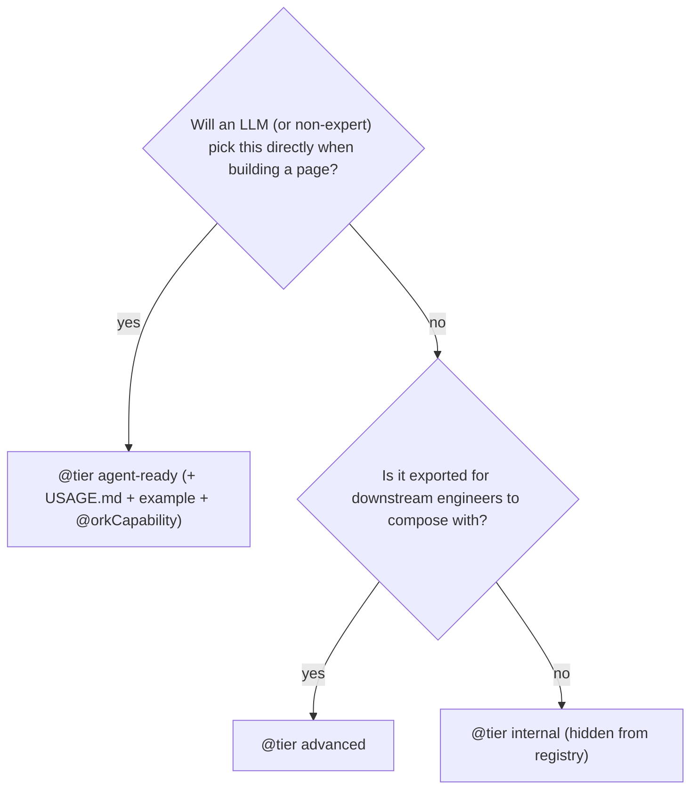
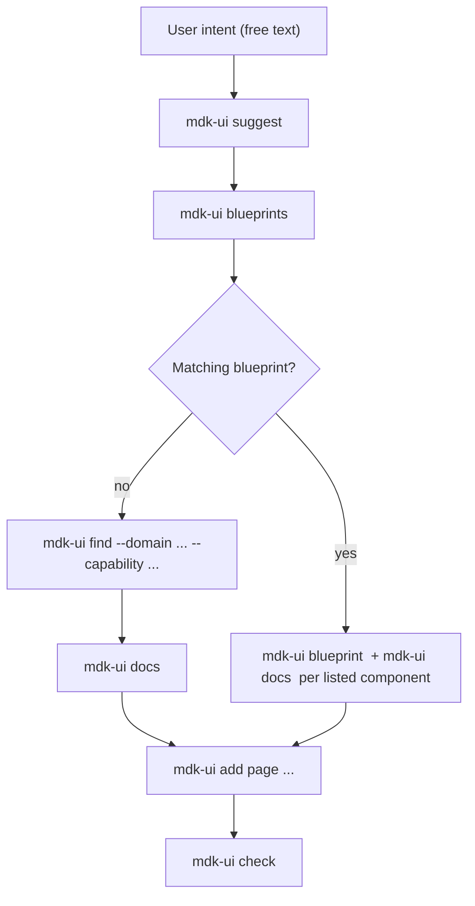

<!-- markdownlint-disable MD041 -->
# Agent-Ready Contract — `@tetherto/mdk-react-devkit`

The single source of truth for **what to ship with every public export** so
AI agents and humans can both consume the devkit reliably. Linked from the
root [`AGENTS.md`](../../AGENTS.md), referenced by every error the
`check:agent-ready` CI gate emits, and bundled in the npm tarball so
downstream agents can read it too.

> If you're new to the agent-first design, read [`docs/AGENT_FIRST.md`](../../docs/AGENT_FIRST.md) first, it's the
> architecture tour. **This file is the contract** every public export must
> satisfy.

## TL;DR

Three tiers, one decision:

| Tier          | Use when…                                            | Must add                                                                                                                  |
| ------------- | ---------------------------------------------------- | ------------------------------------------------------------------------------------------------------------------------- |
| `agent-ready` | LLMs / non-experts will pick this component directly | JSDoc summary + `@category` + `@domain` + `@tier` + `@orkCapability` + `USAGE.md` + `*.example.tsx`                       |
| `advanced`    | Engineers extending the library use it directly      | JSDoc summary + `@category` + `@domain` + `@tier`                                                                         |
| `internal`    | Implementation detail, never part of the public API  | `@tier internal` (the registry generator drops these — no `USAGE.md` or examples required)                                |



## Required JSDoc tags

| Tag              | Required for         | Allowed values                                                                                       |
| ---------------- | -------------------- | ---------------------------------------------------------------------------------------------------- |
| `@tier`          | every public export  | `agent-ready` &#124; `advanced` &#124; `internal`                                                    |
| `@category`      | tier ≠ `internal`    | `charts` &#124; `tables` &#124; `cards` &#124; `forms` &#124; `dialogs` &#124; `navigation` &#124; `layout` &#124; `widgets` &#124; `dashboards` &#124; `actions` &#124; `feedback` &#124; `misc` |
| `@domain`        | tier ≠ `internal`    | `mining-operations` &#124; `financial-reporting` &#124; `device-management` &#124; `generic`         |
| `@orkCapability` | `agent-ready` **with** `@domain ≠ generic` | `hashrate-monitoring` &#124; `pool-performance` &#124; `energy-consumption` &#124; `incident-alerts` &#124; `device-telemetry` &#124; `device-management` &#124; *(extendable)* — required for mining domains, skipped for generic primitives |
| `@example`       | optional, encouraged | inline TSX in the JSDoc                                                                              |

The first paragraph of the JSDoc above an export becomes the registry
`description`. Keep it ≤ 200 chars; longer prose belongs in co-located
[`USAGE.md`](src/foundation/components/active-incidents-card/USAGE.md)
next to each export (see skeleton in [`CONTRIBUTING.md`](../../../CONTRIBUTING.md))
or the filled reference under [Pointers](#pointers).

## Paste-ready templates

### Agent-ready component

```tsx
/**
 * One-paragraph summary. Describe what the component renders and the
 * canonical use case. Don't list every prop, the registry captures those
 * automatically.
 *
 * @category cards
 * @domain mining-operations
 * @orkCapability incident-alerts
 * @tier agent-ready
 */
export const MyCard = forwardRef<HTMLDivElement, MyCardProps>(
  function MyCard(props, ref) { /* ... */ },
);
```

Plus, next to the component file:

```
my-card/
  index.tsx
  my-card.example.tsx       ← runnable example, imports only from "@tetherto/mdk-react-devkit"
  USAGE.md                  ← summary + props table + minimal example + notes
```

`USAGE.md` skeleton:

```markdown
# MyCard

One-paragraph summary of what the component does.

## Props

| Prop  | Type     | Required | Default | Description                |
| ----- | -------- | -------- | ------- | -------------------------- |
| `foo` | `string` | yes      | —       | The primary thing.         |

## Minimal example

```tsx
<MyCard foo="hello" />
```

## Notes

- Anything non-obvious about composition, accessibility, performance.
```

### Advanced component

```tsx
/**
 * One-paragraph summary aimed at engineers extending the library.
 *
 * @category layout
 * @domain generic
 * @tier advanced
 */
export const InternalLayoutHelper = (/* … */) => { /* ... */ };
```

No `USAGE.md`, no example required, JSDoc is enough.

### Internal export

```tsx
/** @tier internal */
export const _privateHelper = () => { /* ... */ };
```

The registry generator drops internal entries entirely. Nothing else
required, but prefer **not exporting** if it truly is private.

### Agent-ready hook

```tsx
/**
 * Read the current device list for the active site. Updates whenever
 * telemetry refresh ticks.
 *
 * @category data
 * @domain device-management
 * @orkCapability device-management
 * @tier agent-ready
 *
 * @returns devices keyed by id, plus an `isLoading` flag.
 */
export const useDevices = (): UseDevicesResult => { /* ... */ };
```

## How the gate runs

```bash
# Locally
npm run check:agent-ready --workspace @tetherto/mdk-react-devkit
```

```bash
# As part of the full suite (lint + typecheck + format + agent-ready + tests)
npm run fullcheck
# Auto-runs on every PR in the `quality` CI job.
```

The check loads `dist/registry.json` and `dist/blueprints.json`, applies the
rules above, and compares against
[`scripts/agent-ready-baseline.json`](scripts/agent-ready-baseline.json):

- A violation **not** in the baseline is a hard error (exit 1).
- A violation **in** the baseline is reported as debt and does not fail the
  build.
- The baseline can only ever shrink. After fixing a JSDoc gap, run:

```bash
npm run check:agent-ready --workspace @tetherto/mdk-react-devkit -- --update-baseline
git add packages/react-devkit/scripts/agent-ready-baseline.json
```

To audit total debt locally (ignore the baseline):

```bash
node packages/react-devkit/scripts/check-agent-ready.mjs --no-baseline
```

## Error catalogue

Every rule emitted by `check:agent-ready` and the one-line fix:

| Error id                                | Fix                                                                                                            |
| --------------------------------------- | -------------------------------------------------------------------------------------------------------------- |
| `missing-tier`                          | Add `@tier agent-ready` / `advanced` / `internal`. Every public export must declare its audience.              |
| `missing-description`                   | Add a JSDoc summary above the export — the first paragraph is captured into the registry.                      |
| `description-too-short`                 | Replace the auto-generated placeholder with a 1–2 sentence summary. Must be ≥40 chars and not match `"<Name> component."` / `"Use <Name> hook."` templates. |
| `missing-category`                      | Add `@category <bucket>` (see "Required JSDoc tags" above for the allowed values).                             |
| `missing-domain`                        | Add `@domain <area>` — one of `mining-operations`, `financial-reporting`, `device-management`, `generic`.      |
| `agent-ready-missing-usage`             | Create `USAGE.md` next to the component (summary + props table + minimal example + notes).                     |
| `agent-ready-missing-example`           | Add `<name>.example.tsx` next to the component (mock data only; imports must use `@tetherto/mdk-react-devkit`).|
| `agent-ready-missing-ork-capability`    | Add at least one `@orkCapability <id>` tag so agents can find the component by capability.                     |
| `blueprint:<id>: component <X> ...`     | The blueprint references a component that's missing from the registry or not `agent-ready`. Fix or remove.     |
| `blueprint:<id>: hook <X> ...`          | The blueprint references a hook that doesn't exist in the registry. Fix or remove.                             |

## Navigating by intent

Once a component is `agent-ready`, an LLM can find it via three layered
surfaces, none of which require model calls:

### 1. O(1) lookup indexes (`dist/registry.json` → `indexes`)

The registry ships indexes alongside the flat arrays:

```jsonc
"indexes": {
  "componentsByName":          { "ActiveIncidentsCard": 0, "DataTable": 1, /* … */ },
  "componentsByCategory":      { "charts": ["LineChartCard", …], … },
  "componentsByDomain":        { "mining-operations": [...], … },
  "componentsByOrkCapability": { "hashrate-monitoring": [...], … },
  "componentsByTier":          { "agent-ready": [...] }
}
```

`componentsByName[<Name>]` returns the index into `components[]` — true O(1).
The other indexes return arrays of names; agents combine them with the
`byName` lookup.

### 2. Blueprints (`dist/blueprints.json`)

Curated recipes mapping a user intent to a concrete starting set. Authored
under [`blueprints/`](blueprints/README.md) and machine-indexed at build time.

| Blueprint                       | Use when…                                                       |
| ------------------------------- | --------------------------------------------------------------- |
| `mining-operations-dashboard`   | "Show me my miners" / "live operator dashboard".                |
| `reporting`                     | "Monthly report" / "CSV export" / "historical numbers".         |
| `device-management`             | "Manage miners" / "drill into one device".                      |
| `custom-feature`                | The user's domain is out-of-scope (weather, inventory, social). |

### 3. CLI navigation commands

The deterministic decision flow agents follow:



Worked examples — three intents, three paths through the tools:

- **"Build me a full mining operating system."**
  `mdk-ui blueprints` → `mdk-ui blueprint mining-operations-dashboard` →
  follow the listed components, run `mdk-ui docs <Name>` on each, then
  `mdk-ui add page` + `mdk-ui check`.

- **"Add a reporting tool to my app."**
  `mdk-ui blueprint reporting` → same flow. `StatsExport`, `LineChartCard`,
  and `HistoricalAlerts` are the canonical set.

- **"Add weather functionality."**
  `mdk-ui blueprint custom-feature` → MDK does not ship weather components.
  The blueprint enumerates the core primitives (`Card`, `LineChart`,
  `DataTable`, …) to compose against and explicitly tells the agent not to
  fork mining components for an unrelated domain.

## Pointers

- Registry schema: [`scripts/registry-types.ts`](scripts/registry-types.ts).
- Reference for "well-documented agent-ready component":
  [`src/foundation/components/active-incidents-card/`](src/foundation/components/active-incidents-card/USAGE.md).
- Reference for "well-documented agent-ready hook" — coming when we tier
  the first hook as `agent-ready`.
- Downstream usage (consumer apps): [`../cli/README.md`](../cli/README.md).
- Architecture tour: [`docs/AGENT_FIRST.md`](../../docs/AGENT_FIRST.md).
