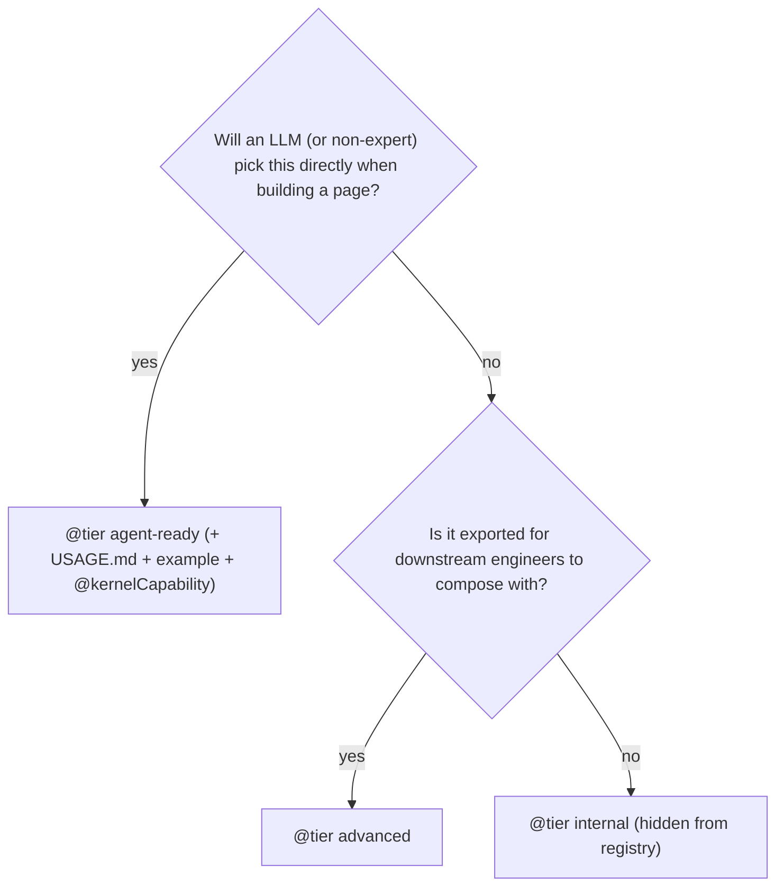
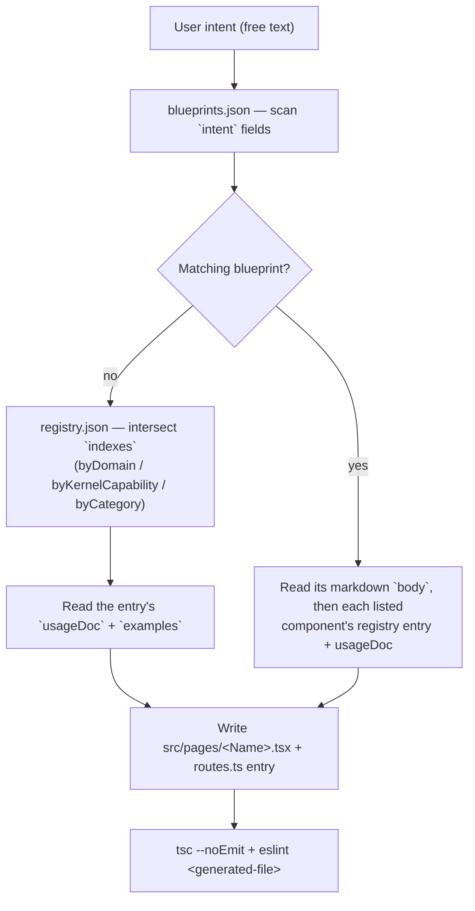

<!-- markdownlint-disable MD041 -->
# Agent-ready contract — `@tetherto/mdk-react-devkit`

The single source of truth for **what to ship with every public export** so
AI agents and humans can both consume the devkit reliably. Linked from the
root [`AGENTS.md`](../../AGENTS.md), referenced by every error the
`check:agent-ready` CI gate emits, and bundled in the npm tarball so
downstream agents can read it too.

> If you're new to the agent-first design, read [`docs/AGENT_FIRST.md`](../../docs/AGENT_FIRST.md) first, it's the
> architecture tour. **This file is the contract** every public export must
> satisfy.

## TL;DR

Three tiers, one decision:

| Tier          | Use when…                                            | Must add                                          |
| ------------- | ---------------------------------------------------- | ------------------------------------------------- |
| `agent-ready` | LLMs / non-experts pick this component directly | JSDoc summary + `@category` + `@domain` + `@tier` + `@kernelCapability` + `USAGE.md` + `*.example.tsx` |
| `advanced`    | Engineers extending the library use it directly      | JSDoc summary + `@category` + `@domain` + `@tier` |
| `internal`    | Implementation detail, never part of the public API  | `@tier internal` (the registry generator drops these — no `USAGE.md` or examples required) |


```mermaid
flowchart TD
  ask{"Will an LLM (or non-expert) pick this directly when building a page?"}
  ask -- yes --> agentReady["@tier agent-ready (+ USAGE.md + example + @kernelCapability)"]
  ask -- no --> ask2{"Is it exported for downstream engineers to compose with?"}
  ask2 -- yes --> advanced["@tier advanced"]
  ask2 -- no --> internal["@tier internal (hidden from registry)"]
```

## Required JSDoc tags

| Tag                 | Required for                               | Allowed values                                                 |
| ------------------- | ------------------------------------------ | -------------------------------------------------------------- |
| `@tier`             | every public export                        | `agent-ready` &#124; `advanced` &#124; `internal`              |
| `@category`         | tier ≠ `internal`                          | `charts` &#124; `tables` &#124; `cards` &#124; `forms` &#124; `dialogs` &#124; `navigation` &#124; `layout` &#124; `widgets` &#124; `dashboards` &#124; `actions` &#124; `feedback` &#124; `misc` |
| `@domain`           | tier ≠ `internal`                          | `mining-operations` &#124; `financial-reporting` &#124; `device-management` &#124; `generic` |
| `@kernelCapability` | `agent-ready` **with** `@domain ≠ generic` | `hashrate-monitoring` &#124; `pool-performance` &#124; `energy-consumption` &#124; `incident-alerts` &#124; `device-telemetry` &#124; `device-management` &#124; *(extendable)* — required for mining domains, skipped for generic primitives |
| `@example`          | optional, encouraged                       | inline TSX in the JSDoc                                        |

The first paragraph of the JSDoc above an export becomes the registry
`description`. Keep it ≤ 200 chars; longer prose belongs in co-located
[`USAGE.md`](src/domain/components/active-incidents-card/USAGE.md)
next to each export (see skeleton in [`CONTRIBUTING.md`](../../../CONTRIBUTING.md))
or the filled reference under [Pointers](#pointers).

## Paste-ready templates

### Agent-ready component

```tsx
/**
 * One-paragraph summary. Describe what the component renders and the
 * canonical use case. Don't list every prop, the registry captures those
 * automatically.
 *
 * @category cards
 * @domain mining-operations
 * @kernelCapability incident-alerts
 * @tier agent-ready
 */
export const MyCard = forwardRef<HTMLDivElement, MyCardProps>(
  function MyCard(props, ref) { /* ... */ },
);
```

Plus, next to the component file:

```
my-card/
  index.tsx
  my-card.example.tsx       ← runnable example, imports only from "@tetherto/mdk-react-devkit"
  USAGE.md                  ← summary + props table + minimal example + notes
```

`USAGE.md` skeleton:

```markdown
# MyCard

One-paragraph summary of what the component does.

## Props

| Prop  | Status   | Type     | Default | Description       |
| ----- | -------- | -------- | ------- | ----------------- |
| `foo` | Required | `string` | —       | The primary thing |

## Minimal example

```tsx
<MyCard foo="hello" />
```

## Notes

- Anything non-obvious about composition, accessibility, performance.
```

> **How this renders — write the prose, let the pipeline own props & examples.**
> The docs site does **not** render `USAGE.md` verbatim. `<ComponentDoc>`
> renders the description (from your JSDoc), the props table (from the registry
> types), and the runnable examples (from `*.example.tsx`) *structurally* from
> those authoritative sources. To avoid printing the same thing twice, it then
> strips the leading `# Title`, the `## Props` section, and the
> `## Example`/`## Examples` section out of your `USAGE.md` before rendering the
> rest — so only your **intro paragraph and `## Notes`** (and any other prose)
> reach the page.
>
> Practical takeaways when authoring `USAGE.md`:
> - Put your effort into the **summary and Notes** — composition, gotchas,
>   accessibility, performance. That prose is what the site actually shows, and
>   the pipeline can't generate it.
> - The `## Props` and example blocks above are **optional and harmless**: the
>   site ignores them, but an agent reading `USAGE.md` straight off disk sees
>   the raw file, so keeping it self-contained still helps. If you keep them,
>   keep them accurate — the props table in the
>   registry (from your types) is the source of truth, not this copy.

### Advanced component

```tsx
/**
 * One-paragraph summary aimed at engineers extending the library.
 *
 * @category layout
 * @domain generic
 * @tier advanced
 */
export const InternalLayoutHelper = (/* … */) => { /* ... */ };
```

No `USAGE.md`, no example required, JSDoc is enough.

### Internal export

```tsx
/** @tier internal */
export const _privateHelper = () => { /* ... */ };
```

The registry generator drops internal entries entirely. Nothing else
required, but prefer **not exporting** if it truly is private.

### Agent-ready hook

```tsx
/**
 * Read the current device list for the active site. Updates whenever
 * telemetry refresh ticks.
 *
 * @category data
 * @domain device-management
 * @kernelCapability device-management
 * @tier agent-ready
 *
 * @returns devices keyed by id, plus an `isLoading` flag.
 */
export const useDevices = (): UseDevicesResult => { /* ... */ };
```

## How the gate runs

```bash
# Locally
npm run check:agent-ready --workspace @tetherto/mdk-react-devkit
```

```bash
# As part of the full suite (lint + typecheck + format + agent-ready + tests)
npm run fullcheck
# Auto-runs on every PR that touches ui/ or CI infra, as the
# "🤖 Agent-readiness contract (UI)" job in the root .github/workflows/ci.yml.
```

The check loads [`dist/registry.json`](./dist/registry.json) and [`dist/blueprints.json`](./dist/blueprints.json), applies the
rules above, and compares against
[`scripts/agent-ready-baseline.json`](scripts/agent-ready-baseline.json):

- A violation **not** in the baseline is a hard error (exit 1).
- A violation **in** the baseline is reported as debt and does not fail the
  build.
- The baseline can only ever shrink. After fixing a JSDoc gap, run:

```bash
npm run check:agent-ready --workspace @tetherto/mdk-react-devkit -- --update-baseline
git add packages/react-devkit/scripts/agent-ready-baseline.json
```

To audit total debt locally (ignore the baseline):

```bash
node packages/react-devkit/scripts/check-agent-ready.mjs --no-baseline
```

The `USAGE.md` prop-table policy (`check-usage-proptables.mjs`, also run by
`check:agent-ready`) works the same way against its own
[`scripts/usage-proptable-baseline.json`](scripts/usage-proptable-baseline.json).
That baseline is additionally guarded in root CI by the **🔒 USAGE baseline
monotonicity** job, which compares it against the pull request base as sets:
removing a path passes, adding one fails. So the baseline cannot be grown to
baseline-in a new prop table — it can only shrink as tables migrate to JSDoc.

## Error catalogue

Every rule emitted by `check:agent-ready` and the one-line fix:

| Error id                                | Fix                                                                                          |
| --------------------------------------- | -------------------------------------------------------------------------------------------- |
| `missing-tier`                          | Add `@tier agent-ready` / `advanced` / `internal`. Every public export must declare its audience |
| `missing-description`                   | Add a JSDoc summary above the export — the first paragraph is captured into the registry     |
| `description-too-short`                 | Replace the auto-generated placeholder with a 1–2 sentence summary. Must be ≥40 chars and not match `"<Name> component."` / `"Use <Name> hook."` templates. |
| `missing-category`                      | Add `@category <bucket>` (see "Required JSDoc tags" above for the allowed values)            |
| `missing-domain`                        | Add `@domain <area>` — one of `mining-operations`, `financial-reporting`, `device-management`, `generic`. |
| `agent-ready-missing-usage`             | Create `USAGE.md` next to the component (summary + props table + minimal example + notes)    |
| `agent-ready-missing-example`           | Add `<name>.example.tsx` next to the component (mock data only; imports must use `@tetherto/mdk-react-devkit`). |
| `agent-ready-missing-kernel-capability` | Add at least one `@kernelCapability <id>` tag so agents can find the component by capability |
| `blueprint:<id>: component <X> ...`     | The blueprint references a component that's missing from the registry or not `agent-ready`. Fix or remove. |
| `blueprint:<id>: hook <X> ...`          | The blueprint references a hook that doesn't exist in the registry. Fix or remove.          |

## Navigating by intent

Once a component is `agent-ready`, an LLM can find it via three layered
surfaces, none of which require model calls:

### 1. O(1) lookup indexes ([`dist/registry.json`](./dist/registry.json) → `indexes`)

The registry ships indexes alongside the flat arrays:

```jsonc
"indexes": {
  "componentsByName":          { "ActiveIncidentsCard": 0, "DataTable": 1, /* … */ },
  "componentsByCategory":      { "charts": ["LineChartCard", …], … },
  "componentsByDomain":        { "mining-operations": [...], … },
  "componentsByKernelCapability": { "hashrate-monitoring": [...], … },
  "componentsByTier":          { "agent-ready": [...] }
}
```

`componentsByName[<Name>]` returns the index into `components[]` — true O(1).
The other indexes return arrays of names; agents combine them with the
`byName` lookup.

### 2. Blueprints ([`dist/blueprints.json`](./dist/blueprints.json))

Curated recipes mapping a user intent to a concrete starting set. Authored
under [`blueprints/`](blueprints/README.md) and machine-indexed at build time.

| Blueprint                     | Use when…                                                       |
| ----------------------------- | --------------------------------------------------------------- |
| `mining-operations-dashboard` | "Show me my miners" / "live operator dashboard".                |
| `reporting`                   | "Monthly report" / "CSV export" / "historical numbers".         |
| `device-management`           | "Manage miners" / "drill into one device".                      |
| `custom-feature`              | The user's domain is out-of-scope (weather, inventory, social). |

### 3. Navigating the manifests

The deterministic decision flow agents follow — every step is a plain read of
a `dist/*.json` file:


```mermaid
flowchart TD
  intent["User intent (free text)"] --> step1["blueprints.json — scan `intent` fields"]
  step1 --> step2{"Matching blueprint?"}
  step2 -- yes --> useBp["Read its markdown `body`, then each listed\ncomponent's registry entry + usageDoc"]
  step2 -- no --> step3["registry.json — intersect `indexes`\n(byDomain / byKernelCapability / byCategory)"]
  step3 --> step4["Read the entry's `usageDoc` + `examples`"]
  step4 --> scaffold["Write src/pages/&lt;Name&gt;.tsx + routes.ts entry"]
  useBp --> scaffold
  scaffold --> verify["tsc --noEmit + eslint &lt;generated-file&gt;"]
```

Worked examples — three intents, three paths through the manifests:

- **"Build me a full mining operating system."**
  `blueprints.json` → the `mining-operations-dashboard` entry → follow the
  components it lists, reading each one's registry entry and `usageDoc`, then
  write the page and typecheck it.

- **"Add a reporting tool to my app."**
  The `reporting` blueprint → same flow. `StatsExport`, `LineChartCard`,
  and `HistoricalAlerts` are the canonical set.

- **"Add weather functionality."**
  The `custom-feature` blueprint → MDK does not ship weather components.
  It enumerates the core primitives (`Card`, `LineChart`, `DataTable`, …) to
  compose against and explicitly tells the agent not to fork mining
  components for an unrelated domain.

## Pointers

- Registry schema: [`scripts/registry-types.ts`](scripts/registry-types.ts)
- Reference for "well-documented agent-ready component":
  [`src/domain/components/active-incidents-card/`](src/domain/components/active-incidents-card/USAGE.md)
- Reference for "well-documented agent-ready hook" — coming when we tier
  the first hook as `agent-ready`.
- Downstream usage (consumer apps): [`AGENTS.md`](../../AGENTS.md).
- Architecture tour: [`docs/AGENT_FIRST.md`](../../docs/AGENT_FIRST.md).
